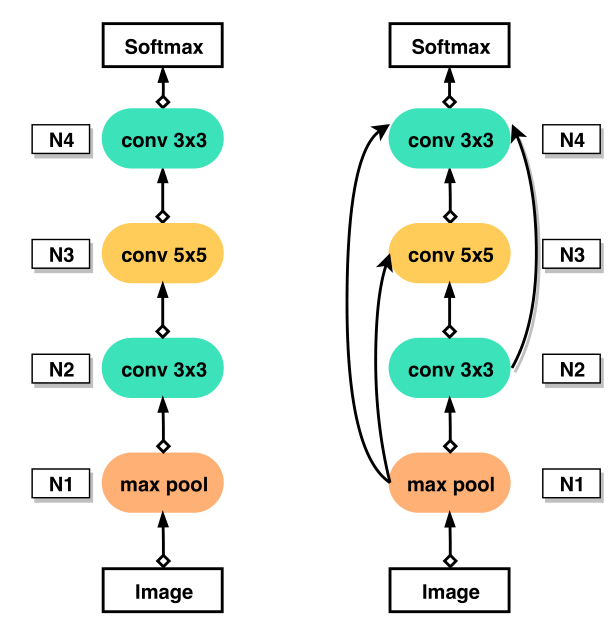
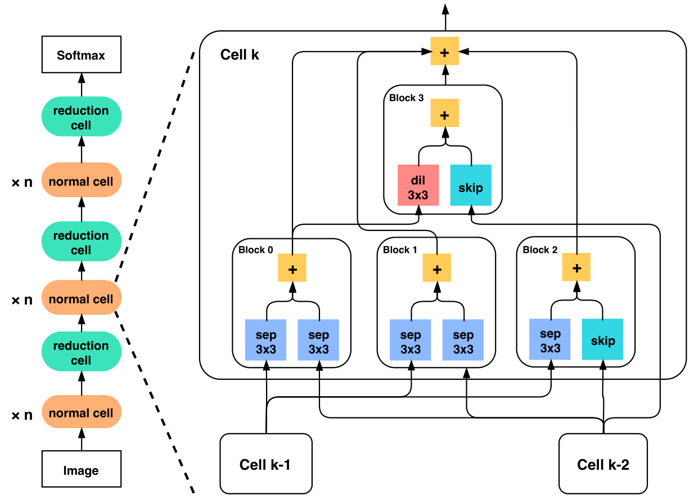
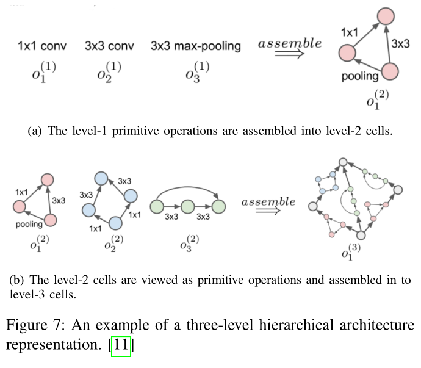
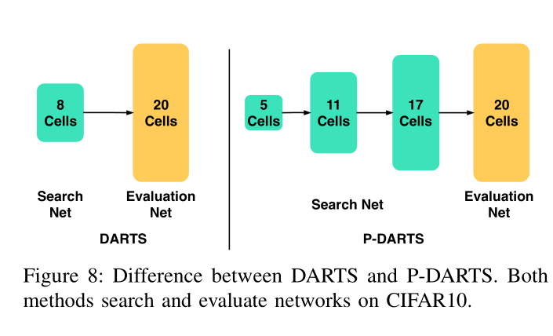
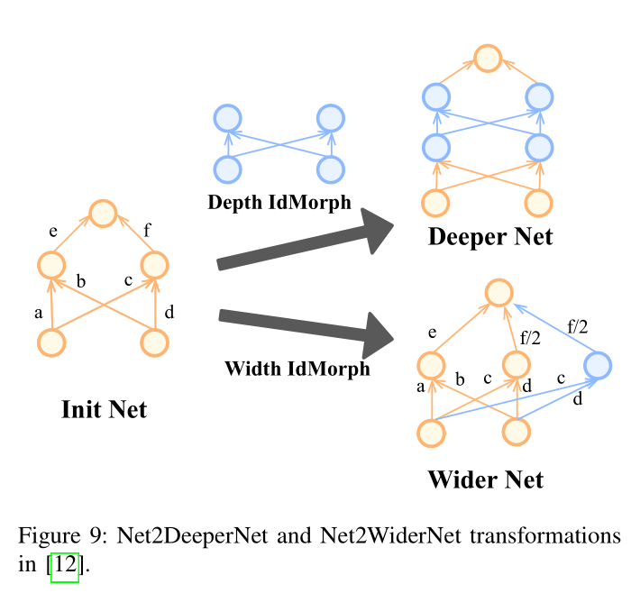
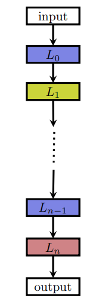
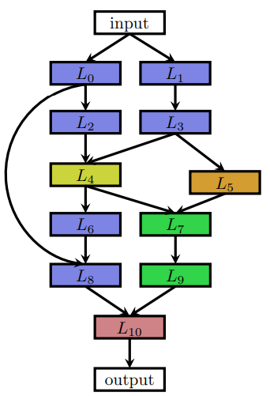

-----

| Title     | ML AutoML NAS SearchSpace                             |
| --------- | ----------------------------------------------------- |
| Created @ | `2020-07-17T06:25:15Z`                                |
| Updated @ | `2023-03-25T14:50:08Z`                                |
| Labels    | \`\`                                                  |
| Edit @    | [here](https://github.com/junxnone/aiwiki/issues/392) |

-----

# Search Space

| Search Space     | Description                                          |
| ---------------- | ---------------------------------------------------- |
| Entire Structure | 完整的网络结构，每层的结构从 search space 中选择，`skip-connection` 可选 |
| Cell-Based       | 先搜索表现好的 `Cell`, 再堆叠 `Cell`                           |
| Hierarchical 分层  | 增加 `Cell` 的多样性                                       |
| Morphism Based   | 在深度宽度等可变操作上扩展现有模型                                    |

## Entire & Cell

| Search Space | Entire-Structured                                            | Cell-Based                                                   |
| ------------ | ------------------------------------------------------------ | ------------------------------------------------------------ |
| Figure       |  |  |
| 优缺点          | 耗时                                                           | 特征图的大小和通道数变化固定                                               |

## Hierarchical & Morphism

| Search Space | Hierarchical (Progressive?)                                                                                                   | Morphism based                                               |
| ------------ | ----------------------------------------------------------------------------------------------------------------------------- | ------------------------------------------------------------ |
| Figure       |    |  |

## chain & multi-branch

| chain-structured neural networks                             | multi-branch networks                                        |
| ------------------------------------------------------------ | ------------------------------------------------------------ |
|  |  |
