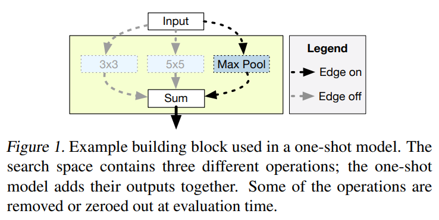
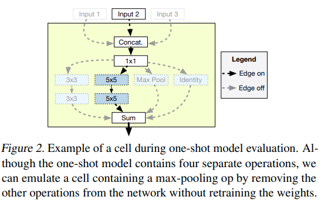
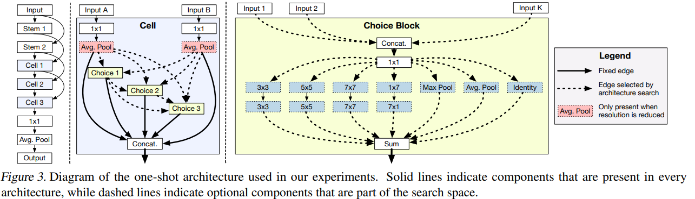

-----

| Title     | ML AutoML NAS OneShot                                 |
| --------- | ----------------------------------------------------- |
| Created @ | `2020-07-17T03:11:00Z`                                |
| Updated @ | `2023-03-25T14:53:12Z`                                |
| Labels    | \`\`                                                  |
| Edit @    | [here](https://github.com/junxnone/aiwiki/issues/393) |

-----

# One-Shot

  - 将搜索空间定义为超级网络 `SuperNet` - 包含全部网络
  - `One-Shot` 共享权重
  - `One-Shot` vs `One-Stage`
      - `One-Stage` - 搜索完之后模型可以直接使用，而不再需要retrain等操作
      - `One-Shot` - 构造 `SuperNet`
      - 大部分 `One-Stage` 是 `One-Shot`

| Optimization | Description       | Examples                                                                                                                            |
| ------------ | ----------------- | ----------------------------------------------------------------------------------------------------------------------------------- |
| Coupled      | 网络结构和权重 & 子网络结构之间 | DARTS ENAS                                                                                                                       |
| Decoupled    | 网络结构和权重           | Understanding and Simplifying One-Shot Architecture Search Single Path One-Shot Neural Architecture Search with Uniform Sampling |

## Arch

  - Net = `Input -> Stem -> Cell -> ... -> Output`
  - Cell = `Choice Blocks x N` (`hyper-parameter` N=4)
  - Cell Input
      - 1 之前 Cell 的 Output
      - 2 同一个 Cell 之前 Choice Block 的 Output

| Building Block                                               | Evaluation                                                   |
| ------------------------------------------------------------ | ------------------------------------------------------------ |
|  |  |

## Steps

  - 构建 One-Shot Model
  - Training One-Shot Model
  - 在 `Val Set` 使用 `pre-trained weight` 评估候选网络
  - 从头开始训练选出的网络, 在 `Test Set` 上评估

## Search Space

  - Search Space 应该足够大, 丰富，足够找到候选网络
  - One-Shot Model 的精度要和 Stand-alone Model 相关
  - 足够小，减少资源需求

## Choice Block

| Choice Block Operations                         | Example                                    |
| ----------------------------------------------- | ------------------------------------------ |
| identity                                        | Input -\> Output                           |
| a pair of depthwise separable 3x3 convolutions  | Input -\> 3x3 Conv -\> 3x3 Conv -\> Output |
| a pair of depthwise separable 5x5 convolutions  | Input -\> 5x5 Conv -\> 5x5 Conv -\> Output |
| a pair of depthwise separable 7x7 convolutions  | Input -\> 7x7 Conv -\> 7x7 Conv -\> Output |
| a 1x7 convolution followed by a 7x1 convolution | Input -\> 1x7 Conv -\> 7x1 Conv -\> Output |
| a max pooling layer                             | Input -\> Max Pool -\> Output              |
| an average pooling layer                        | Input -\> Avg Pool -\> Output              |

## Reference

  - [paper - 2017 - SMASH: One-Shot Model Architecture Search through
    HyperNetworks](https://arxiv.org/abs/1708.05344)
  - [paper - 2018 - Understanding and Simplifying One-Shot Architecture
    Search](http://proceedings.mlr.press/v80/bender18a.html) - -
    [Download](https://github.com/junxnone/tech-io/files/4959070/bender18a.pdf)
  - [One-Shot NAS
    algorithms](https://github.com/microsoft/nni/blob/master/docs/zh_CN/NAS/NasGuide.md)
  - [【论文笔记系列】- Understanding and Simplifying One-Shot Architecture
    Search](https://www.cnblogs.com/marsggbo/p/13195496.html)
  - [AutoDL论文解读（七）：基于one-shot的NAS](https://blog.csdn.net/u014157632/article/details/102600575)
  - [基于one-shot的NAS（上）](https://zhuanlan.zhihu.com/p/98198201)
