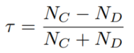

-----

| Title     | ML AutoML NAS Metrics                                 |
| --------- | ----------------------------------------------------- |
| Created @ | `2020-07-17T02:37:41Z`                                |
| Updated @ | `2023-03-25T14:53:49Z`                                |
| Labels    | \`\`                                                  |
| Edit @    | [here](https://github.com/junxnone/aiwiki/issues/394) |

-----

# NAS Metrics

  - Accuracy
  - Efficiency
      - GPU Days = N X D = `Number of GPUs` X `Number of days`
  - Kendall Tau metric

| Kendall Tau metric |  |
| ------------------ | ------------------------------------------------------------ |
| NC                 | concordant                                                   |
| ND                 | discordant                                                   |
| τ = 1              | 两个 `rankings` 一致, 算法在搜索和评估阶段都表现比较好                           |
| τ = -1             | 两个 `rankings` 完全相反, 算法搜索表现好, 但是评估阶段差                         |
| τ = 0              | 两个 `rankings` 不相关, 类似随机搜索                                    |
