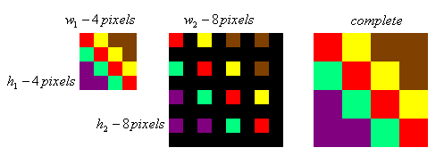
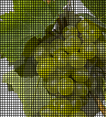

-----

| Title     | CV NearestNeighborInterpolation                       |
| --------- | ----------------------------------------------------- |
| Created @ | `2020-04-08T05:48:22Z`                                |
| Updated @ | `2023-03-27T14:27:22Z`                                |
| Labels    | \`\`                                                  |
| Edit @    | [here](https://github.com/junxnone/aiwiki/issues/397) |

-----

# Nearest Neighbor interpolation - 最近邻插值

  - 将目标图像各点的像素值设为源图像中与其最近的点

-----

**计算方法** 

  - (w1, h1) 原图宽高
  - (w2, h2) 目标宽高

`Pixel Value @(Xi, Yi) = Pixels[floor(Xi * x_ratio), floor(Yi *
y_ratio)]`

-----

| Scale                  | Image                                                        |
| ---------------------- | ------------------------------------------------------------ |
| Original               |  |
| 200%                   |  |
| 200% with black pixels |  |
| 130%                   |  |
| 130% with black pixels |  |
| 50%                    |  |

-----

  - 计算量较小
  - 可能会造成插值生成的图像灰度上的不连续，在灰度变化的地方可能出现明显的锯齿状

## Refernece

  - [图像处理: 五种
    插值法](https://blog.csdn.net/jningwei/article/details/78822026)
  - [Image scaling -
    wikipedia](https://en.wikipedia.org/wiki/Image_scaling)
  - [数字图像处理笔记二 - 图片缩放(最近邻插值(Nearest Neighbor
    interpolation))](https://blog.csdn.net/haluoluo211/article/details/80918147)
  - [Nearest Neighbor Image
    Scaling](http://tech-algorithm.com/articles/nearest-neighbor-image-scaling/)
  - [Nearest-neighbor interpolation -
    wikipedia](https://en.wikipedia.org/wiki/Nearest-neighbor_interpolation)
