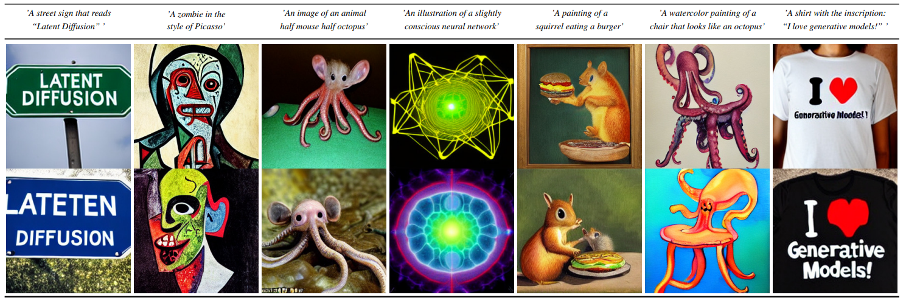
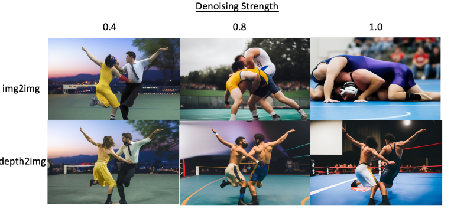
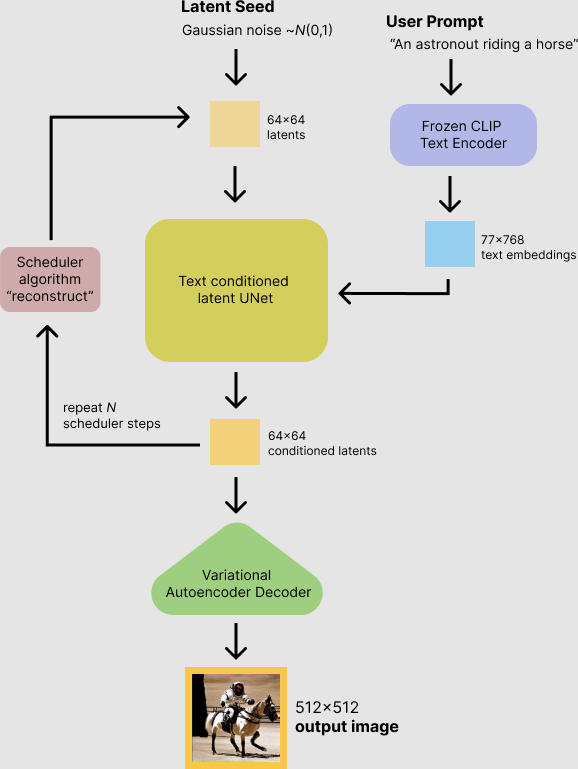

-----

| Title     | Hot StableDiffusion                                   |
| --------- | ----------------------------------------------------- |
| Created @ | `2023-05-16T13:25:14Z`                                |
| Updated @ | `2023-06-07T01:44:35Z`                                |
| Labels    | \`\`                                                  |
| Edit @    | [here](https://github.com/junxnone/aiwiki/issues/402) |

-----

# Stable Diffusion

  - Text2Image
  - Image2Image
  - Depth2Image

## Text2Image

## Depth2Image

## Inference

## Reference

  - 2021.12 [High-Resolution Image Synthesis with Latent Diffusion
    Models](https://arxiv.org/abs/2112.10752)
  - [awesome-stable-diffusion](https://github.com/awesome-stable-diffusion/awesome-stable-diffusion)
  - [Stable Diffusion
    reimagine](https://clipdrop.co/stable-diffusion-reimagine)
  - [Stable diffusion - Hugging
    Face](https://huggingface.co/docs/diffusers/v0.16.0/en/api/pipelines/stable_diffusion/overview)
  - [Stable Diffusion Colab
    Inference](https://colab.research.google.com/github/huggingface/notebooks/blob/main/diffusers/stable_diffusion.ipynb)
