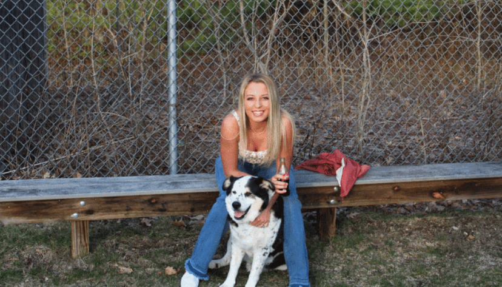

-----

| Title     | Hot LaMa                                              |
| --------- | ----------------------------------------------------- |
| Created @ | `2023-05-31T02:40:17Z`                                |
| Updated @ | `2023-05-31T02:40:17Z`                                |
| Labels    | \`\`                                                  |
| Edit @    | [here](https://github.com/junxnone/aiwiki/issues/404) |

-----

# LaMa - Image Inpainting

| Before                                                       | After                                                        |
| ------------------------------------------------------------ | ------------------------------------------------------------ |
|  |  |

## Reference

  - 2021 **LaMa** Resolution-robust Large Mask Inpainting with Fourier
    Convolutions \[[paper](https://arxiv.org/abs/2109.07161)\]
    \[[project](https://advimman.github.io/lama-project/)\]
    \[[code](https://github.com/advimman/lama)\]
