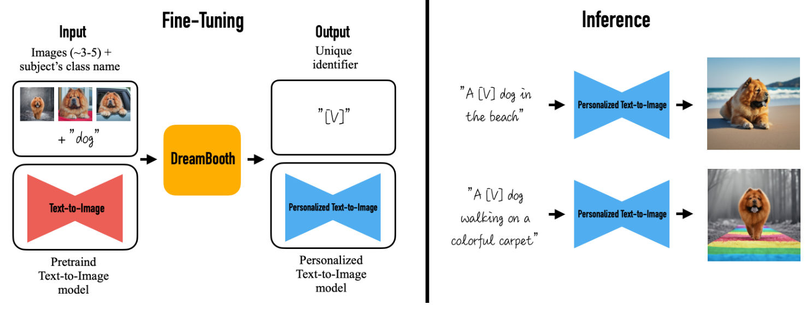
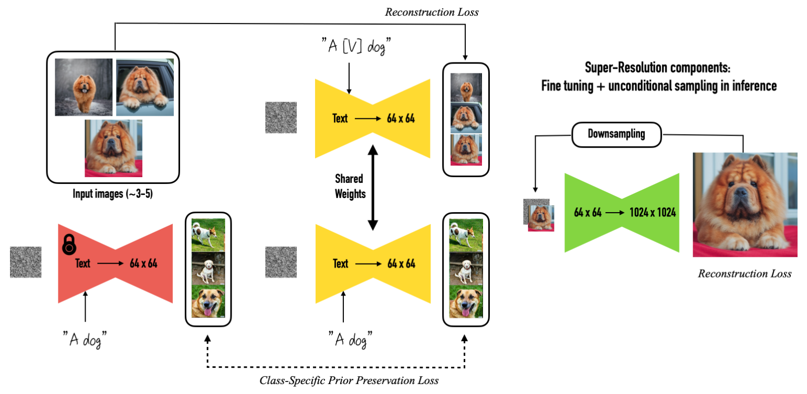

-----

| Title     | Hot LM Tuning DreamBooth                              |
| --------- | ----------------------------------------------------- |
| Created @ | `2023-06-02T06:52:09Z`                                |
| Updated @ | `2023-06-13T15:16:11Z`                                |
| Labels    | \`\`                                                  |
| Edit @    | [here](https://github.com/junxnone/aiwiki/issues/405) |

-----

# DreamBooth

  - Fine Tuning Text-to-Image Diffusion Models
  - Text2Image 个性化方法: 通过 `Prompts` 使 `Object` 出现在新的场景中

## Arch

## Reference

  - [DreamBooth Doc](https://dreambooth.github.io/)
  - [DreamBooth Dataset - Google](https://github.com/google/dreambooth)
  - paper 2022 [DreamBooth: Fine Tuning Text-to-Image Diffusion Models
    for Subject-Driven Generation](https://arxiv.org/abs/2208.12242)
  - [DreamBooth - Hugging
    Face](https://huggingface.co/docs/diffusers/training/dreambooth)
