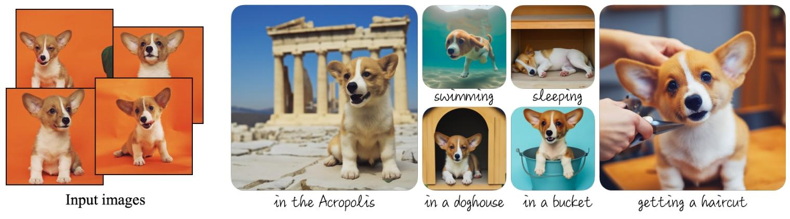

-----

| Title     | LM FT DreamBooth                                      |
| --------- | ----------------------------------------------------- |
| Created @ | `2023-06-02T06:52:09Z`                                |
| Updated @ | `2025-06-12T01:41:21Z`                                |
| Labels    | \`\`                                                  |
| Edit @    | [here](https://github.com/junxnone/aiwiki/issues/405) |

-----

# DreamBooth

  - Fine Tuning Text-to-Image Diffusion Models
  - Text2Image 个性化方法: 通过 `Prompts` 使 `Object` 出现在新的场景中
      - DreamBooth 使用 3\~5 张照片让 AI Model 记住 某个特定物体的外观，可以生成该物体在特定场景的图片
      - 物体越常见越好，罕见物体可能需要更多图片
  - 应用场景
      - 换背景
      - 艺术风格转换
      - 视角与属性修改
      - 

## Arch

  - 使用罕见 token 作为唯一标识符，避免 token 被模型原有语义干扰
  - 类先验保留损失（PPL）
      - 避免语言漂移(让模型误以为 “狗” 这个词只能指代特定个体，导致生成其他狗的能力丧失。)
      - 避免过拟合(模型只记住输入图片的背景或姿态（如狗总是站在草地），生成新场景时缺乏多样性。)
  - 

## Reference

  - [DreamBooth Doc](https://dreambooth.github.io/)
  - [DreamBooth Dataset - Google](https://github.com/google/dreambooth)
  - paper 2022 [DreamBooth: Fine Tuning Text-to-Image Diffusion Models
    for Subject-Driven Generation](https://arxiv.org/abs/2208.12242)
  - [DreamBooth - Hugging
    Face](https://huggingface.co/docs/diffusers/training/dreambooth)
