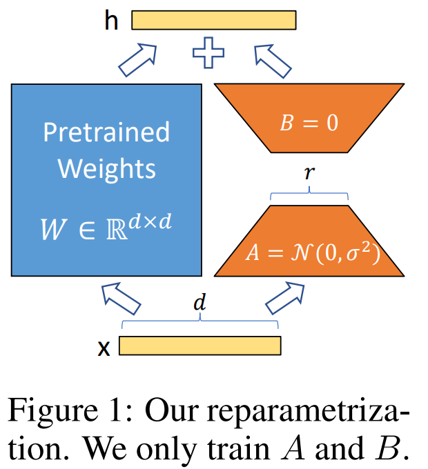
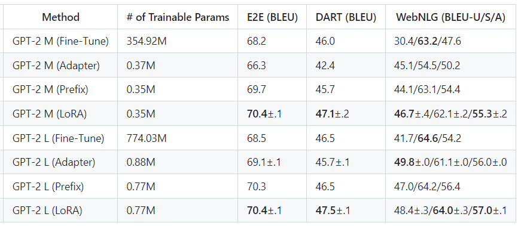

-----

| Title     | Hot LM Tuning LoRA                                    |
| --------- | ----------------------------------------------------- |
| Created @ | `2023-06-02T07:07:34Z`                                |
| Updated @ | `2023-06-13T15:16:15Z`                                |
| Labels    | \`\`                                                  |
| Edit @    | [here](https://github.com/junxnone/aiwiki/issues/406) |

-----

# LoRA

  - LoRA - `Low-Rank Adaptation` 是微软研究员引入的一项新技术，主要用于处理大模型微调的问题。
  - 已有研究表明了过度参数化的模型其实是位于一个低的内在维度上，所以作者假设在模型适应过程中的权重变化也具有较低的“内在等级”

## Arch

  - 冻结预训练模型的权重
  - 将 `rank-decompostion matrices` 添加到 Transformer 的每一层来训练

## 模型合并

  - LoRA + BigMdel
  - $W = W\_0 + BA$
  - 微调后由 $h=W\_0x$ 变为 $h=Wx$

### 比较

## Reference

  - paper 2021 [LoRA: Low-Rank Adaptation of Large Language
    Models](https://arxiv.org/abs/2106.09685) \[[Code -
    Microsoft](https://github.com/microsoft/LoRA)\]
  - [lora - Huggingface
    PEFT](https://github.com/huggingface/peft/blob/main/src/peft/tuners/lora.py)
  - [使用 LoRA 进行 Stable Diffusion
    的高效参数微调](https://huggingface.co/blog/zh/lora)
  -
