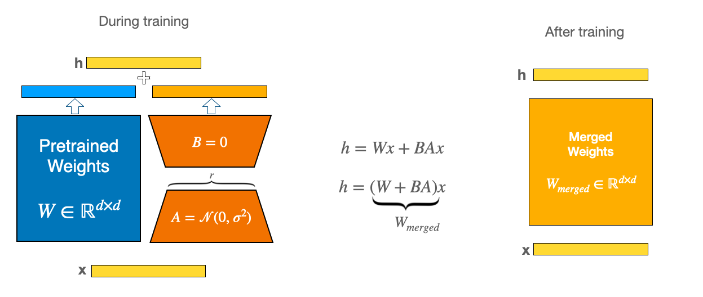
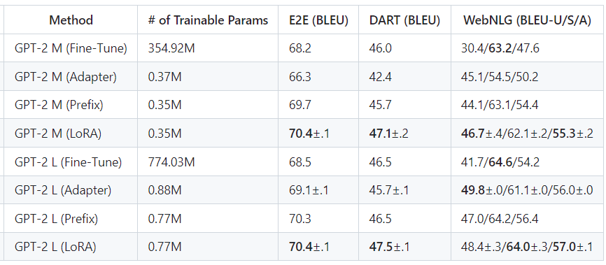

-----

| Title     | LM FT LoRA                                            |
| --------- | ----------------------------------------------------- |
| Created @ | `2023-06-02T07:07:34Z`                                |
| Updated @ | `2025-01-24T02:53:24Z`                                |
| Labels    | \`\`                                                  |
| Edit @    | [here](https://github.com/junxnone/aiwiki/issues/406) |

-----

# LoRA

  - LoRA - `Low-Rank Adaptation` 是微软研究员引入的一项新技术，主要用于处理大模型微调的问题。
  - 在神经网络中，权重矩阵通常是高维的。LoRa 假设这些权重矩阵可以分解为低秩的形式。
  - 已有研究表明了过度参数化的模型其实是位于一个低的内在维度上，所以作者假设在模型适应过程中的权重变化也具有较低的“内在等级”

## Arch

  - 冻结预训练模型的权重
  - 将 `rank-decompostion matrices` 添加到 Transformer 的每一层来训练

## 模型合并

  - LoRA + BigMdel
  - $W = W\_0+\\Delta W = W\_0 + BA$
      - $W\_0$ 是预训练模型的原始权重矩阵
      - $\\Delta W =BA$ : $\\Delta W$ 被分解为两个低秩矩阵 $B$ $A$ 的乘积
      - $B$ $A$ 是对原始权重矩阵进行微小的调整，以适应特定的下游任务。
  - 微调后由 $h=W\_0x$ 变为 $h=Wx$

### Example Fc1

### 比较

## LoRA 变种

### LoRA+

  - LoRA+的作者可以证明，只有单一的学习率是次优的。将矩阵B的学习率设置为远高于矩阵A的学习率，可以使得训练更加高效。
  - 矩阵B的初始化为0，所以需要比随机初始化的矩阵a需要更大的更新步骤。通过将矩阵B的学习率设置为矩阵A的16倍，作者已经能够在模型精度上获得小幅提高(约2%)，同时将RoBERTa或lama-7b等模型的训练时间加快2倍。

### VeRA

  - `Vector-based Random Matrix Adaptation`
  - 没有训练矩阵A和B而是用共享的随机权值初始化这些矩阵(即所有层中所有矩阵A和B都具有相同的权值)，并添加两个新的向量d和B，微调的时候只训练向量d和B。
  - 基于一个有趣的研究领域，即所谓的随机预测。
  - 通过引入向量d和b只训练这些相关的子网络，与原始的LoRa方法相反矩阵A和b是冻结的，并且矩阵B不再被设置为零，而是像矩阵A一样随机初始化
  - 产生比完整矩阵a和b小得多的参数。

### LoRA-FA

  - `LoRA - Frozen-A`
  - 矩阵A在初始化后被冻结，因此作为随机投影。矩阵B不是添加新的向量，而是在用零初始化之后进行训练
  - 参数数量减半，同时具有与普通LoRA相当的性能。

### LoRA-Drop

  - 引入了一种算法来决定哪些层由LoRA微调，哪些层不需要。
  - 对数据的一个子集进行采样，训练LoRA进行几次迭代。然后将每个LoRA适配器的重要性计算为BAx，其中A和B是LoRA矩阵，x是输入。这是添加到冻结层输出中的LoRA的输出。如果这个输出很大，说明它会更剧烈地改变行为。如果它很小，这表明LoRA对冻结层的影响很小可以忽略。
  - 与训练所有的LoRA层相比，准确度只有微小的变化，但由于必须训练的参数数量较少，因此减少了计算时间。

### AdaLoRA

  - 考虑将LoRA矩阵的奇异值作为其重要性的指标。
  - 不同的适配器具有不同的秩
  - 比标准的LoRA方法产生更好的结果

## Reference

  - paper 2021 [LoRA: Low-Rank Adaptation of Large Language
    Models](https://arxiv.org/abs/2106.09685) \[[Code -
    Microsoft](https://github.com/microsoft/LoRA)\]
  - [lora - Huggingface
    PEFT](https://github.com/huggingface/peft/blob/main/src/peft/tuners/lora.py)
  - [使用 LoRA 进行 Stable Diffusion
    的高效参数微调](https://huggingface.co/blog/zh/lora)
  -
