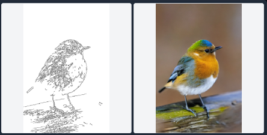
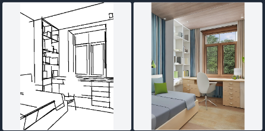
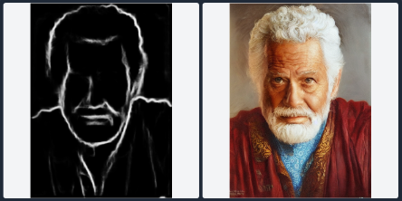
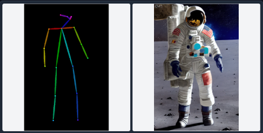
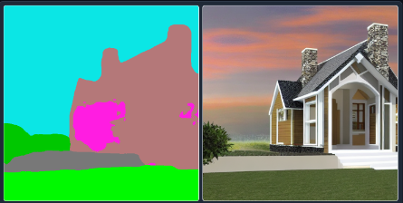
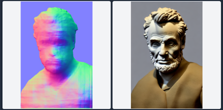
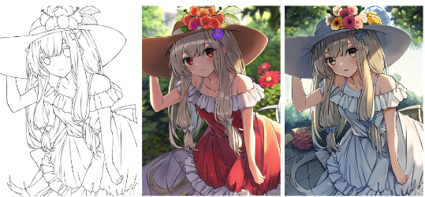
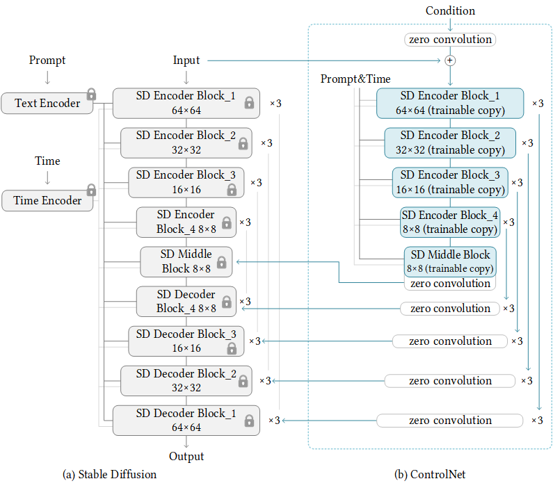

-----

| Title     | paper ControlNet                                      |
| --------- | ----------------------------------------------------- |
| Created @ | `2023-06-02T07:16:30Z`                                |
| Updated @ | `2023-06-05T03:32:25Z`                                |
| Labels    | \`\`                                                  |
| Edit @    | [here](https://github.com/junxnone/aiwiki/issues/407) |

-----

# ControlNet

  - Control diffusion models
  - 添加输入到 `Stable Diffusion` 中 控制生成内容
      - Canny Edge
      - M-LSD Lines
      - HED Boundary
      - User Scribbles
      - Fake Scribbles
      - Human Pose
      - Semantic Segmentation
      - Normal Map
      - Anime Line Drawing

-----

Input Demo

| Input                 | Demo                                                         |
| --------------------- | ------------------------------------------------------------ |
| Canny Edge            |  |
| M-LSD Lines           |  |
| HED Boundary          |  |
| User Scribbles        |  |
| Fake Scribbles        |  |
| Human Pose            |  |
| Semantic Segmentation |  |
| Depth                 |  |
| Normal Map            |  |
| Anime Line Drawing    |  |

## Arch

## Reference

  - paper 2023 **ControlNet** [Adding Conditional Control to
    Text-to-Image Diffusion Models](https://arxiv.org/abs/2302.05543)
    \[[Code](https://github.com/lllyasviel/ControlNet/tree/main)\]
