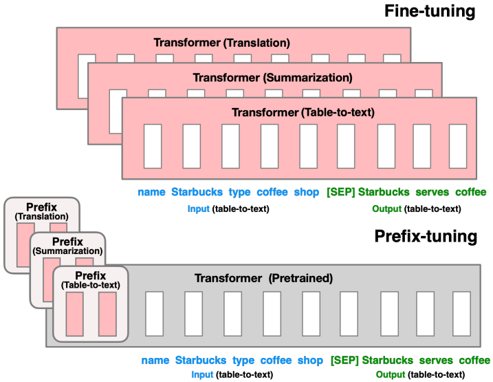
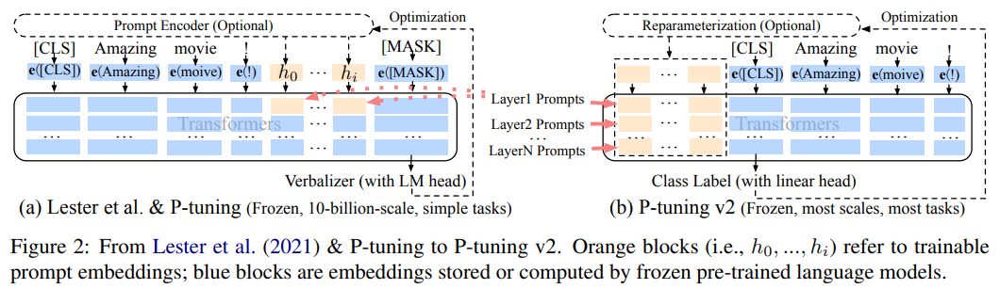

-----

| Title     | Hot LM Tuning PrefixTuning                            |
| --------- | ----------------------------------------------------- |
| Created @ | `2023-06-05T03:43:02Z`                                |
| Updated @ | `2023-06-13T15:16:19Z`                                |
| Labels    | \`\`                                                  |
| Edit @    | [here](https://github.com/junxnone/aiwiki/issues/411) |

-----

# Prefix Tuning

  - 固定预训练模型参数，只对小部分可训练参数微调

## Prefix-Tuning

## P-Tuning V2

## Reference

  - paper 2021 **Prefix-Tuning** [Optimizing Continuous Prompts for
    Generation](https://arxiv.org/abs/2101.00190)
  - paper 2021 **P-Tuning v2** [Prompt Tuning Can Be Comparable to
    Fine-tuning Universally Across Scales and Tasks]()
