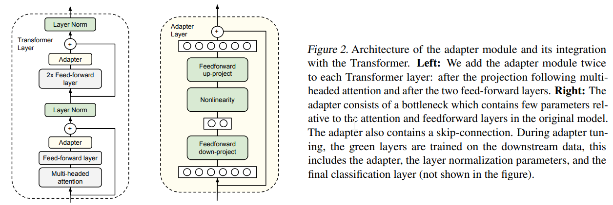

-----

| Title     | Hot LM Tuning Adapter                                 |
| --------- | ----------------------------------------------------- |
| Created @ | `2023-06-05T03:55:55Z`                                |
| Updated @ | `2023-06-13T15:16:07Z`                                |
| Labels    | \`\`                                                  |
| Edit @    | [here](https://github.com/junxnone/aiwiki/issues/412) |

-----

# Adapter FineTuning

  - 添加 `Adapter Module`
  - 固定 pre-trained 网络参数

## Reference

  - paper 2019 [Parameter-Efficient Transfer Learning for
    NLP](https://arxiv.org/abs/1902.00751)
    \[[Code](https://github.com/google-research/adapter-bert)\]
