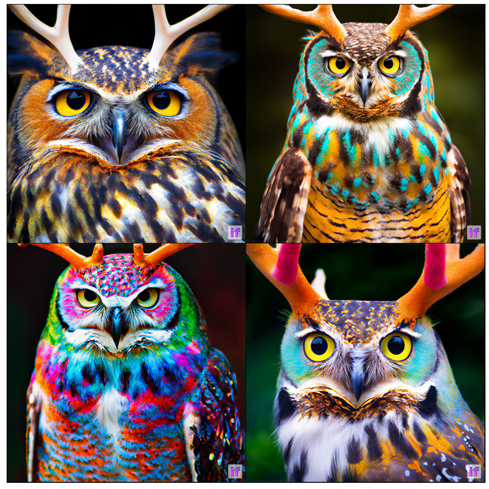
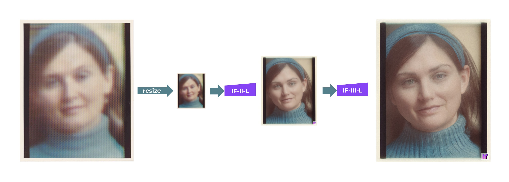

-----

| Title     | Hot Imagen                                            |
| --------- | ----------------------------------------------------- |
| Created @ | `2023-06-07T02:03:36Z`                                |
| Updated @ | `2023-10-18T07:43:02Z`                                |
| Labels    | \`\`                                                  |
| Edit @    | [here](https://github.com/junxnone/aiwiki/issues/413) |

-----

# Imagen

  - Text2Image Model
  - Google Brain
  - DrawBench 新的评估基准
  - Diffusion Model - Pixel Space
  - 功能
      - Text2Image
      - Image2Image Translation
      - Super Resolution
      - Inpainting

| Text2Image                                                 | Image2Image Translation                                    | Super Resolution                                           | Inpainting                                                 |
| ---------------------------------------------------------- | ---------------------------------------------------------- | ---------------------------------------------------------- | ---------------------------------------------------------- |
|  |  |  |  |

## Arch

## Reference

  - [Imagen](https://imagen.research.google/)
  - paper 2022 **Imagen** [Photorealistic Text-to-Image Diffusion Models
    with Deep Language Understanding](https://arxiv.org/abs/2205.11487)
