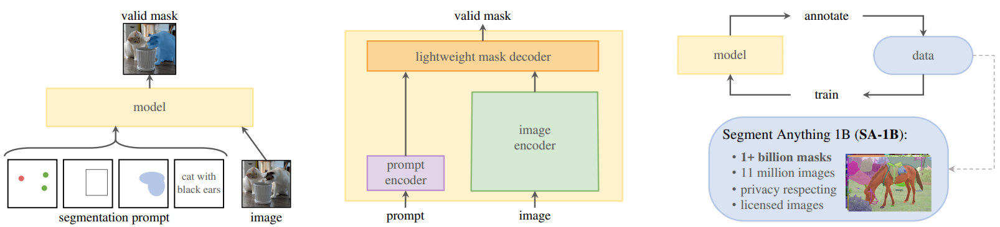
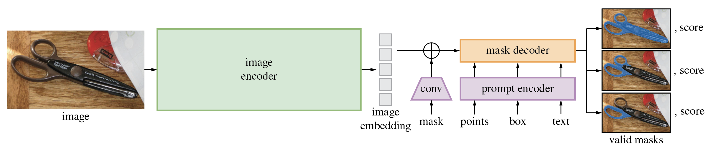

-----

| Title     | Hot SAM                                               |
| --------- | ----------------------------------------------------- |
| Created @ | `2023-06-07T02:11:14Z`                                |
| Updated @ | `2023-10-19T14:30:36Z`                                |
| Labels    | \`\`                                                  |
| Edit @    | [here](https://github.com/junxnone/aiwiki/issues/414) |

-----

# SAM

  - SAM - `Segment Anything Model`
  - a promptable segmentation task
  - a segmentation model (SAM) that powers data annotation and enables
    zero-shot transfer to a range
  - of tasks via prompt engineering
  - a data engine for collecting SA-1B, our dataset of over 1 billion
    masks.

## Arch

## Reference

  - paper 2023 [Segment Anything](https://arxiv.org/abs/2304.02643)
    \[[code](https://github.com/facebookresearch/segment-anything)\]
    \[[demo](https://segment-anything.com/demo)\]
