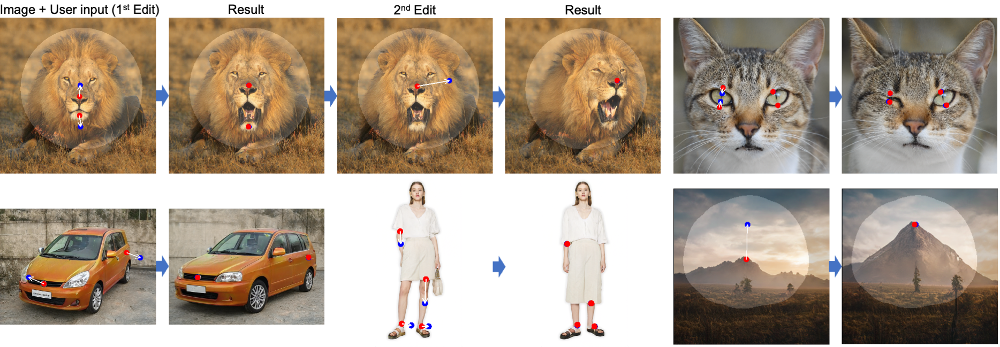

-----

| Title     | Hot DragGAN                                           |
| --------- | ----------------------------------------------------- |
| Created @ | `2023-06-29T10:31:41Z`                                |
| Updated @ | `2023-06-29T10:31:41Z`                                |
| Labels    | \`\`                                                  |
| Edit @    | [here](https://github.com/junxnone/aiwiki/issues/429) |

-----

# DragGAN

  - 通过拖拽可以自动完善图像中的人/动物姿态，衣服/物体/...形状

## Reference

  - 2023.5 [Drag Your GAN: Interactive Point-based Manipulation on the
    Generative Image Manifold](https://arxiv.org/abs/2305.10973)
    \[[code](https://github.com/XingangPan/DragGAN)\]
