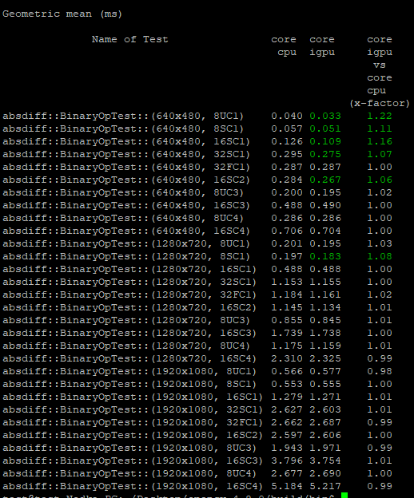
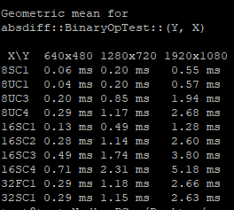

-----

| Title     | OpenCV PerfTest                                       |
| --------- | ----------------------------------------------------- |
| Created @ | `2023-08-02T13:47:29Z`                                |
| Updated @ | `2023-08-04T07:46:25Z`                                |
| Labels    | \`\`                                                  |
| Edit @    | [here](https://github.com/junxnone/aiwiki/issues/431) |

-----

# OpenCV Performance Test

## Build Test Case

  - opencv\_perf\_calib3d
  - opencv\_perf\_core
  - opencv\_perf\_dnn
  - opencv\_perf\_features2d
  - opencv\_perf\_gapi
  - opencv\_perf\_imgcodecs
  - opencv\_perf\_imgproc
  - opencv\_perf\_objdetect
  - opencv\_perf\_photo
  - opencv\_perf\_stitching
  - opencv\_perf\_video
  - opencv\_perf\_videoio

<!-- end list -->

``` 
cmake -DCMAKE_BUILD_TYPE=Release -DBUILD_PERF_TESTS=ON ..
make 
```

## Run Test

    ./opencv_perf_core --gtest_output=xml
    ./opencv_perf_imgproc --gtest_output=xml:result.xml

### Analyzing Result

  - Scripts
      - run.py - tests runner - able to run tests on Windows, Linux,
        Android and Mac (is not tested yet).
      - report.py - prints all measurements from single test run in
        user-friendly way.
      - summary.py - creates comparison table for several test runs
        (able to compare different platforms or revisions).
      - chart.py - shows performance dependencies from test parameters
        (works on single log).

<!-- end list -->

    python ../../modules/ts/misc/report.py core.xml -o html|tee core.html

    python3 ../../modules/ts/misc/summary.py core_cpu.xml core_igpu.xml -f absdiff:



    python3 ../../modules/ts/misc/chart.py core_cpu.xml -f absdiff:



## Reference

  - [Running performance tests and analyzing the
    results](https://github.com/opencv/opencv/wiki/HowToUsePerfTests)
  - [How to Write Perf
    Tests](https://github.com/opencv/opencv/wiki/HowToWritePerfTests)
