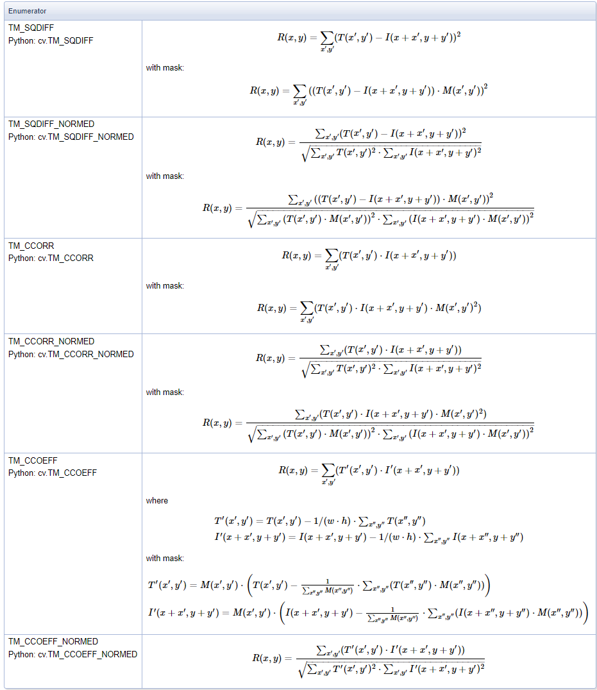

-----

| Title     | OpenCV IP MatchTemplate                               |
| --------- | ----------------------------------------------------- |
| Created @ | `2019-03-16T10:24:15Z`                                |
| Updated @ | `2023-08-03T14:30:28Z`                                |
| Labels    | \`\`                                                  |
| Edit @    | [here](https://github.com/junxnone/aiwiki/issues/433) |

-----

# OpenCV MatchTemplate 模板匹配

  - 在较大图像中搜索和查找模板图像位置
  - `cv.matchTemplate()` 在输入图像上获取滑动 patch，与 模板图像比较
  - 使用了 `Intel IPP` 的实现(SIMD)

## 计算方法

| UseCase         | Pipeline                                                                                            |
| --------------- | --------------------------------------------------------------------------------------------------- |
| **搜索图像中存在一个目标** | \- 输入模板 wxh - 输入图像 WxH - 输出 (W-w+1)x(H-h+1) - 匹配区域 cv.minMaxLoc() 获取左上角位置 取 (w,h) 矩形作为匹配区域 |
| **搜索图像中存在多个目标** | \- 最后使用阈值取左上角点                                                                                      |
| **彩色图像**        | \- 拆分通道分别计算                                                                                         |

## TemplateMatchModes

| Name           | Full Name                         | Loss Function | Description               |
| -------------- | --------------------------------- | ------------- | ------------------------- |
| SQDIFF         | Sum of **Sq**uared **Diff**erence | 差值平方和         | 值越小越接近                    |
| SQDIFF\_NORMED |                                   |               | 归一化                       |
| CCORR          | Cross Correlation                 | 相关度           | 相关匹配，值越大越接近               |
| CCORR\_NORMED  |                                   |               | 归一化                       |
| CCOEFF         | Correlation Coefficient           | 去均值相关         | 相关系数匹配 \[-1, 1\] , 值越大越接近 |
| CCOEFF\_NORMED |                                   |               | 归一化                       |

### 公式

  - $I$ - Image
  - $T$ - Template Image
  - $R$ - Result
  - $M$ - Mask

## Reference

  - [基于Halcon的多目标模板匹配算法](https://blog.csdn.net/x454045816/article/details/52842966)
  - [多目标模板匹配](https://blog.csdn.net/x454045816/article/details/52638528)
  - [SIFT,SURF,ORB,FAST
    特征提取算法比较](https://blog.csdn.net/vonzhoufz/article/details/46594369)
  - [OpenCV 模板匹配 matchTemplate
    源码解析](https://www.zywvvd.com/notes/study/image-processing/opencv/opencv-matchTemplate/opencv-matchtemplate-src/opencv-matchtemplate-src/)
  - [MatchTemplate
    API](https://docs.opencv.org/4.8.0/df/dfb/group__imgproc__object.html#ga586ebfb0a7fb604b35a23d85391329be)
  - [TemplateMatchModes](https://docs.opencv.org/4.8.0/df/dfb/group__imgproc__object.html#ga3a7850640f1fe1f58fe91a2d7583695d)
  - [paper 1995 Fast Normalized
    Cross-Correlation](https://citeseerx.ist.psu.edu/viewdoc/summary?doi=10.1.1.21.6062)
  - [pape 2007 Early Termination Algorithms for Correlation Coefficient
    Based Block
    Matching](https://www.researchgate.net/publication/221123808_Early_Termination_Algorithms_for_Correlation_Coefficient_Based_Block_Matching)
