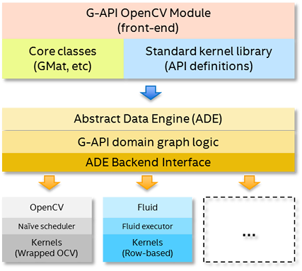

-----

| Title     | OpenCV GAPI                                           |
| --------- | ----------------------------------------------------- |
| Created @ | `2023-08-12T07:46:24Z`                                |
| Updated @ | `2023-08-12T08:18:38Z`                                |
| Labels    | \`\`                                                  |
| Edit @    | [here](https://github.com/junxnone/aiwiki/issues/439) |

-----

# G-API - Graph API

  - 为了构建 `基于图的执行模型`
  - 把`图像处理任务` 构建成 `操作->图`, 然后提交到执行设备(CPU/GPU/...)
  - 分离结构和实现，方便扩展/移植/offloaded 到新平台
  - Backend
      - **G-API CPU**：原来的实现
      - **G-API GPU**：OpenCL 实现（目前使用 T-API`@2023.08`）
      - **G-API Fluid**: 节省内存的实现
      - **G-API OpenVINO**: OpenVINO Inference
      - **G-API ONNX**: ONNX Inference(基于 ONNX Runtime C/C++ API)

## Arch

  - **API Layer**
  - **Graph Compiler Layer**
  - **Backends Layer**
    

## Reference

  - [G-API - OpenCV
    wiki](https://github.com/opencv/opencv/wiki/Graph-API)
  - [G-API - Docs](https://docs.opencv.org/4.0.0/d0/d1e/gapi.html)
  - [Porting anisotropic image segmentation on
    G-API](https://docs.opencv.org/4.0.0/d3/d7a/tutorial_gapi_anisotropic_segmentation.html)
