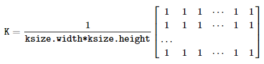

-----

| Title     | OpenCV IP Filter blur                                 |
| --------- | ----------------------------------------------------- |
| Created @ | `2023-09-20T15:22:00Z`                                |
| Updated @ | `2023-09-20T15:22:00Z`                                |
| Labels    | \`\`                                                  |
| Edit @    | [here](https://github.com/junxnone/aiwiki/issues/441) |

-----

# blur 模糊处理

``` 
void cv::blur(InputArray    src,
            OutputArray     dst,
            Size    ksize,
            Point   anchor = Point(-1,-1),
            int     borderType = BORDER_DEFAULT 
)   
```

| 参数         | 描述                                 |
| ---------- | ---------------------------------- |
| ksize      | 使用的 kernel size                    |
| anchor     | 处理时点与 kernel 对应的位置，默认对应 kernel 中心点 |
| borderType | 边界填充模式                             |

> 调用 [boxFilter
> 实现](https://github.com/opencv/opencv/blob/157b0e7760117a60de457a4ae874b0709edc4e53/modules/imgproc/src/box_filter.dispatch.cpp#L492-L498)

| Kernel |  |
| ------ | ------------------------------------------------------------ |

## Reference

  - [boxFilter](https://docs.opencv.org/4.x/d4/d86/group__imgproc__filter.html#gad533230ebf2d42509547d514f7d3fbc3)
