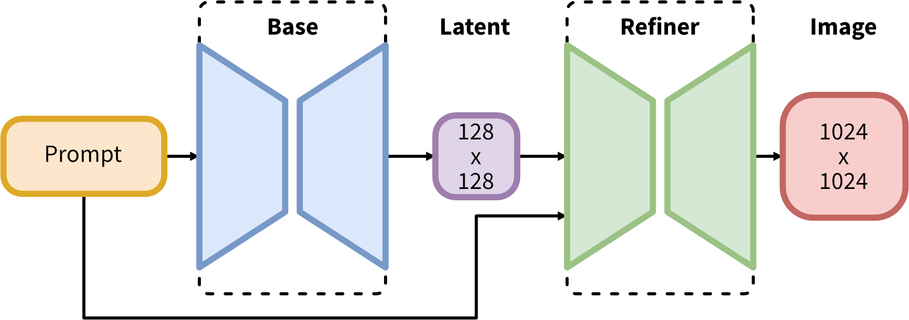

-----

| Title     | Hot StableDiffusion Algos                             |
| --------- | ----------------------------------------------------- |
| Created @ | `2023-10-12T06:32:04Z`                                |
| Updated @ | `2023-10-18T09:21:58Z`                                |
| Labels    | \`\`                                                  |
| Edit @    | [here](https://github.com/junxnone/aiwiki/issues/445) |

-----

# Stable Diffusion 原理

  - Lantent Space - 潜在空间
  - Diffusion Model - 像素空间 (Imagen/DALL-E)
  - Latent Diffusion Model - 潜在扩散模型
  - 条件扩散

> **扩散**: 指物理现象中物质向密度低的方向散开

## Arch

  - VAE: `图像在像素空间和潜在空间转换的工具`
  - UNet: `预测出的噪声残差从原噪声矩阵中去除，得到逐步去噪后的图像Latent Feature`
  - CLIP Text Encoder

### VAE

  - Pixel Space \<=\> Latent Space

### Unet

### Steps

  - 创建一个可用的潜在空间表示，即训练一个 `Autoencoder`, 把图像从像素空间(Pixel Space) 转到
    潜在空间表示(Laten Space)
  - 对潜在空间中图片添加噪声，进行扩散过程 - Diffusion Process
  - 训练一个 `CLIP` 模型 将输入 text 转换为 去噪过程条件
  - 训练模型基于条件对图像去噪 `Denoising`, 获取图片潜在空间表示
      - 条件问 `text`, 即 `text2img`
      - 条件为 `img(+text)`, 即 `img2img`
  - Inference
      - 输入为 `去噪条件`, 去噪获取图片潜在空间表示，经过图像解码器转换获取最终图像

## Reference

  - [Stable Diffusion原理详解](https://developer.aliyun.com/article/1215455)
  - [扩散概率模型 -
    DPM](https://www.zhangzhenhu.com/aigc/%E6%89%A9%E6%95%A3%E6%A6%82%E7%8E%87%E6%A8%A1%E5%9E%8B.html)
  - [深入浅出完整解析Stable
    Diffusion（SD）核心基础知识](https://zhuanlan.zhihu.com/p/632809634)
  - [深入浅出完整解析Stable Diffusion
    XL（SDXL）核心基础知识](https://zhuanlan.zhihu.com/p/643420260)
