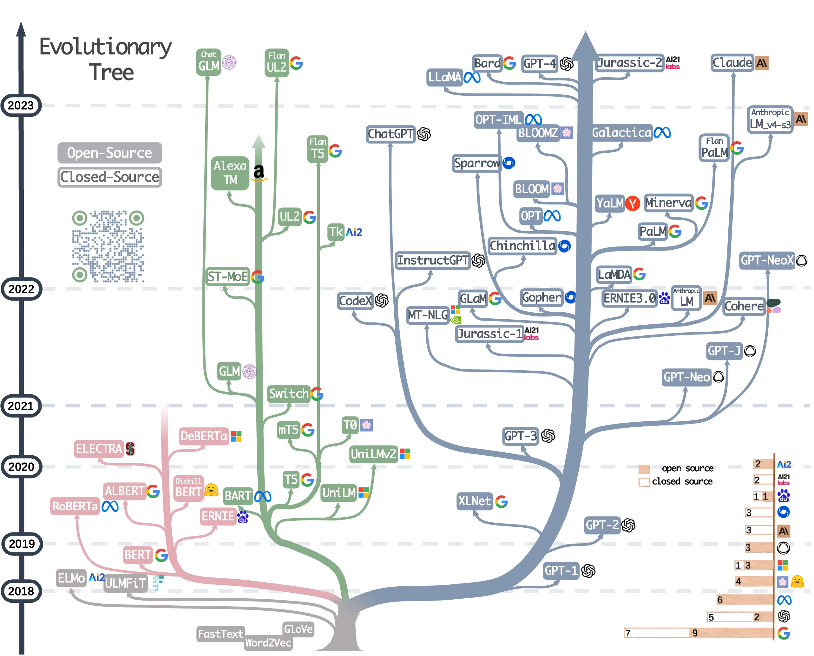

-----

| Title     | Hot LLMs                                              |
| --------- | ----------------------------------------------------- |
| Created @ | `2023-10-12T09:01:24Z`                                |
| Updated @ | `2023-10-12T15:15:33Z`                                |
| Labels    | \`\`                                                  |
| Edit @    | [here](https://github.com/junxnone/aiwiki/issues/446) |

-----

# Large Language Models

## LLM 发展

  - 2021 年之前，以 encoder-only 和 encoder-decoder 为主
  - 2021 年之后，以 decoder-only 为主

## 应用场景

  - ChatBot
  - AI assistant
  - 翻译
  - 有害信息识别
  - Information Retrieval
  - 内容生成
      - 文章
      - 邮件
      - 总结
  - 编程
      - 创建应用
      - 发现威胁/Bug
      - 创建游戏角色
  - 算术/常识推理

## Reference

  - [Awesome-LLM](https://github.com/Hannibal046/Awesome-LLM)
  - `paper@2023` [Harnessing the Power of LLMs in Practice: A Survey on
    ChatGPT and Beyond](https://arxiv.org/pdf/2304.13712.pdf)
    \[[github](https://github.com/Mooler0410/LLMsPracticalGuide)\]
    \[[中译](https://zhuanlan.zhihu.com/p/630216305)\]
  - [LLMs LIsts -
    Wikipedia](https://en.wikipedia.org/wiki/Large_language_model#List)
  - [Open LLM
    Leaderboard](https://huggingface.co/spaces/HuggingFaceH4/open_llm_leaderboard)
