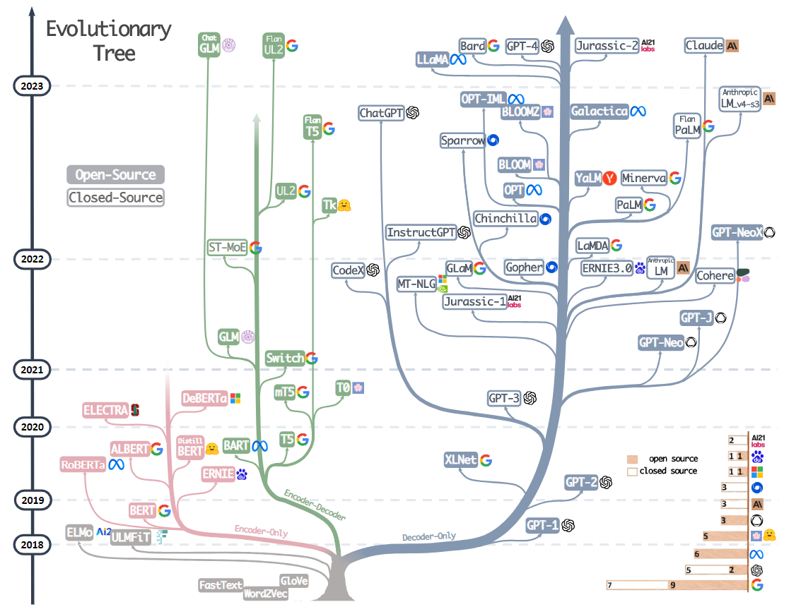

-----

| Title     | LM LLMs                                               |
| --------- | ----------------------------------------------------- |
| Created @ | `2023-10-12T09:01:24Z`                                |
| Updated @ | `2025-01-24T03:06:10Z`                                |
| Labels    | \`\`                                                  |
| Edit @    | [here](https://github.com/junxnone/aiwiki/issues/446) |

-----

# Large Language Models

  - [LLM Leaderboard -
    OpenMMLab](https://opencompass.org.cn/leaderboard-llm)

## LLM 发展

  - 2021 年之前，以 encoder-only 和 encoder-decoder 为主
  - 2021 年之后，以 decoder-only 为主

## 应用场景

  - 主要的方向
      - 自然语言理解
      - 自然语言生成
      - 知识密集型任务
      - 推理能力

### NLU

  - 文本分类
  - 情感分析
  - 有害性检测
  - 自然语言推理 NLI
  - 信息检索
  - 命名实体识别 (NER) - `中间任务` - `用于构建知识图谱`
  - 依赖解析 - `中间任务`

> 对于大多数传统 NLU 任务，就基准数据集的性能和计算成本而言，微调模型是更好的选择。

  - LLMs 表现好的任务
      - 杂项文本分类 - `主题和类别之间可能没有明确或密切的关系`
      - 对抗性 NLI

### AIGC

  - 两类
      - 输入文本转换 - `段落摘要/机器翻译`
      - 开放式生成
  - 文章摘要生成
  - 机器翻译
  - 新闻文章生成
  - 代码生成/修复

> 微调模型，在大多数资源丰富的翻译和资源极少的翻译任务上仍然表现最佳。

### 知识密集型任务

  - 高度依赖背景知识、特定领域专业知识或一般现实世界知识的任务
  - 问答任务
  - 大规模多任务语言理解 (MMLU)
  - 机器阅读理解 MRC

### 推理能力

  - 算术推理
  - 常识推理

> 随着模型规模的指数增长，LLMs 在算术推理和常识推理等方面从非常低的状态转变为可用状态

### 杂项任务

  - ChatBot/AI assistant
  - 数据生成/数据标注

## 训练方式

  - ???
  - `pre-training` + `fine-tuning`
  - **pre-training** 从较大的语料库数据集中学习
  - **fine-tuning** 在目标任务或领域相关的小数据集上训练微调

## Reference

  - [Awesome-LLM](https://github.com/Hannibal046/Awesome-LLM)
  - `paper@2023` [Harnessing the Power of LLMs in Practice: A Survey on
    ChatGPT and Beyond](https://arxiv.org/pdf/2304.13712.pdf)
    \[[github](https://github.com/Mooler0410/LLMsPracticalGuide)\]
    \[[中译](https://zhuanlan.zhihu.com/p/630216305)\]
  - [LLMs LIsts -
    Wikipedia](https://en.wikipedia.org/wiki/Large_language_model#List)
  - [Open LLM
    Leaderboard](https://huggingface.co/spaces/HuggingFaceH4/open_llm_leaderboard)
