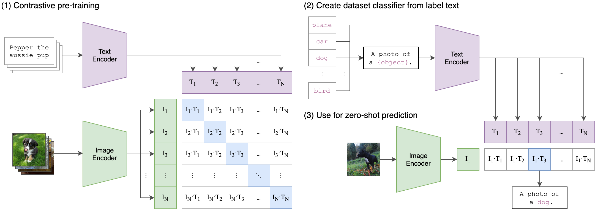
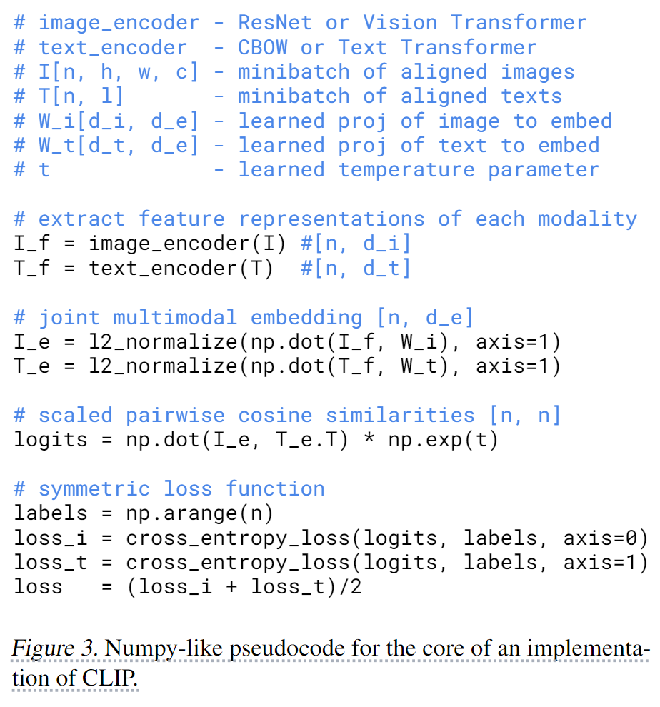
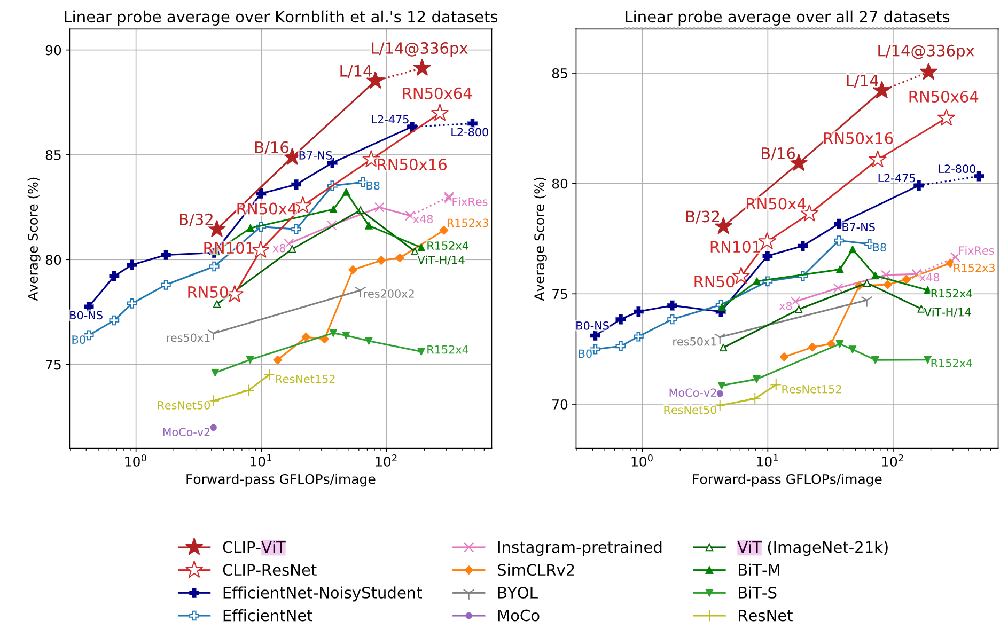

-----

| Title     | Hot CLIP                                              |
| --------- | ----------------------------------------------------- |
| Created @ | `2023-10-17T06:40:49Z`                                |
| Updated @ | `2023-10-17T07:05:51Z`                                |
| Labels    | \`\`                                                  |
| Edit @    | [here](https://github.com/junxnone/aiwiki/issues/448) |

-----

# CLIP

  - CLIP - `Contrastive Language–Image Pre-training` 对比语言图像预训练
  - 可以学习到具有通用性的图像特征
  - 可以进行零样本迁移学习

## Arch

  - Text Encoer & Image Encoder
  - 使用线性投影将每个编码器的表征映射到多模态的嵌入空间

### Image Encoder

  - 作者尝试了 ResNet 和 ViT, ViT 效果更好一点

### Image Encoder

  - Transformer

## Zero-shot Prediction

  - 将数据集中的类别标签转换为文字描述: `bird` =\> `a photo of a “bird"`
  - 转换向量：经过2个encoder，分别输出image和text的feature embedding
  - 计算cosine similarity
  - 预测类别：multinomial logistic regression classifier
  - [example
    code](https://github.com/openai/CLIP/blob/main/README.md#zero-shot-prediction)

## Reference

  - [Code - OpenAI](https://github.com/OpenAI/CLIP)
  - 2021.2 **CLIP** [Learning Transferable Visual Models From Natural
    Language Supervision](https://arxiv.org/abs/2103.00020)
  - [【深度学习】详解
    CLIP](https://blog.csdn.net/qq_39478403/article/details/127858015)
