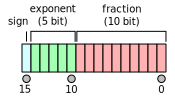

-----

| Title     | x Model Precision                                     |
| --------- | ----------------------------------------------------- |
| Created @ | `2023-10-30T07:33:26Z`                                |
| Updated @ | `2023-10-30T07:59:08Z`                                |
| Labels    | \`\`                                                  |
| Edit @    | [here](https://github.com/junxnone/aiwiki/issues/450) |

-----

# Model Precision

  - 浮点型
      - FP32
      - FP16
      - BF16
  - 整型
      - INT32
      - INT8
      - U8
      - U1

## FP16

## Reference

  - [Hardware
    Precision](https://junxnone.github.io/xwiki/#/0281_Hardware_Precision)
