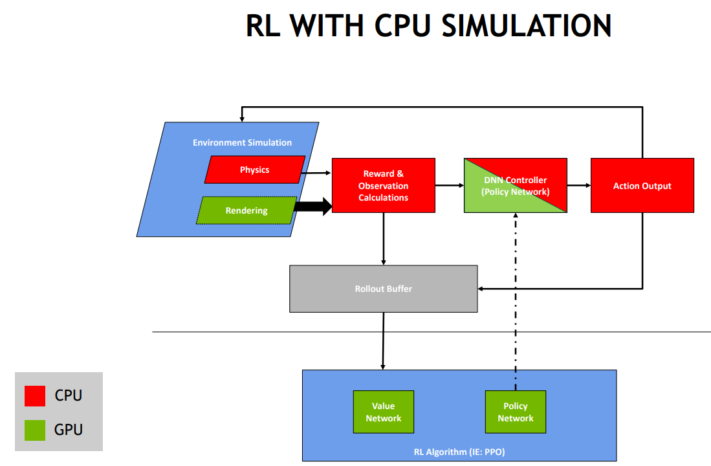
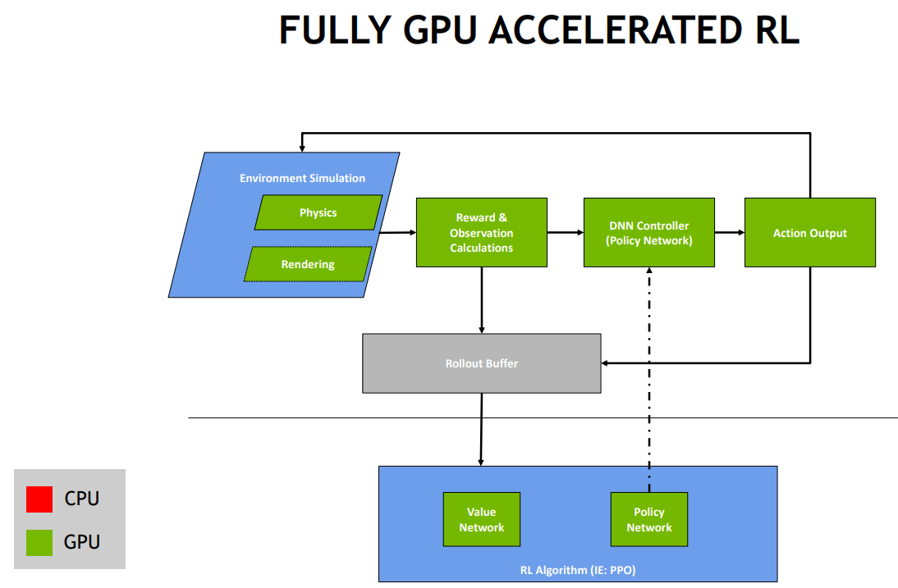
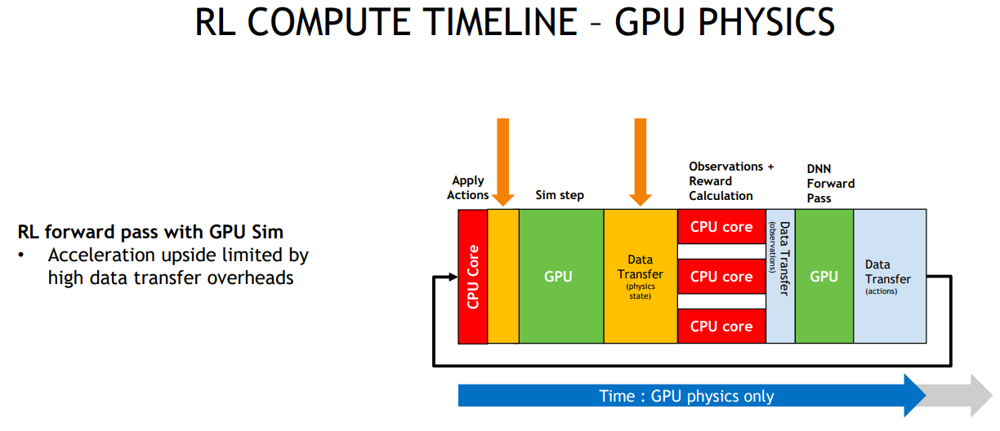
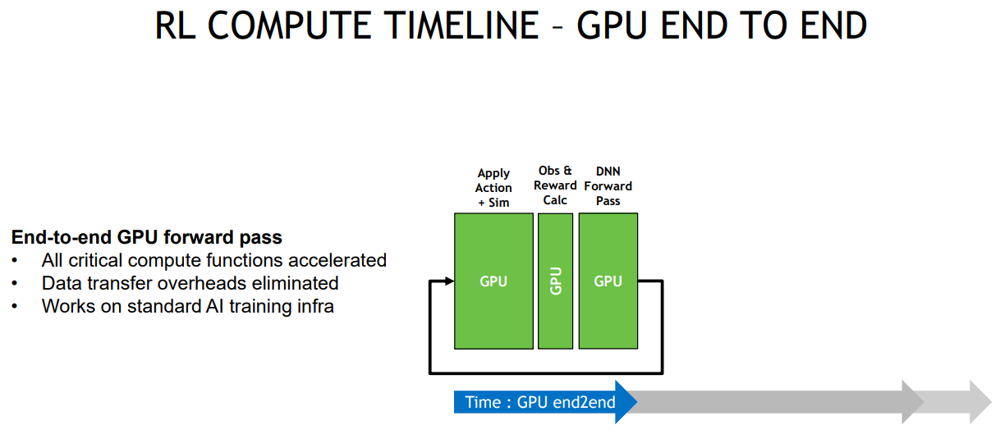
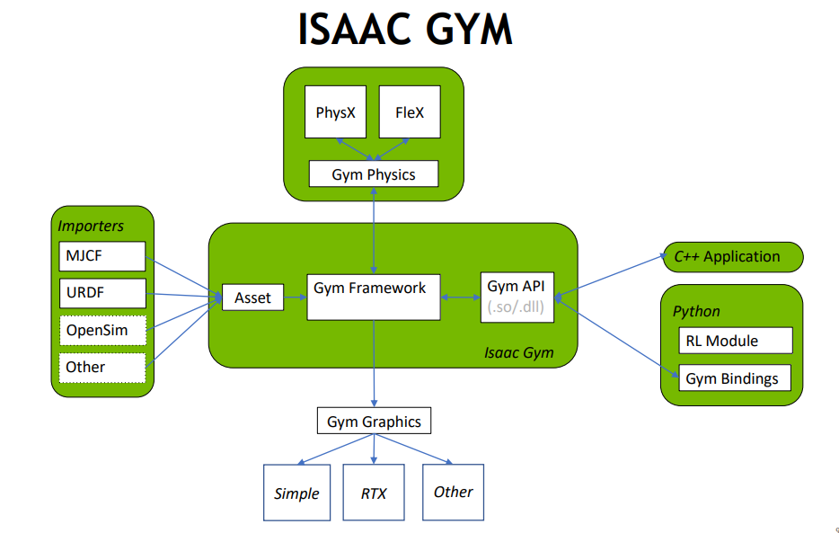

-----

| Title     | Tools IsaacGym                                        |
| --------- | ----------------------------------------------------- |
| Created @ | `2023-10-30T09:59:37Z`                                |
| Updated @ | `2023-11-09T14:56:24Z`                                |
| Labels    | \`\`                                                  |
| Edit @    | [here](https://github.com/junxnone/aiwiki/issues/452) |

-----

# Isaac Gym - Nvidia

  - `Gym` =\> `Gymnasium` `@2022.10` =\> `Omniverse Isaac Gym /Isaac
    Sim？`
  - IsaacGym - NVIDIA’s physics simulation environment for reinforcement
    learning research
      - end-to-end GPU accelerated RL for physically based systems
      - basic PPO implementation +
  - [Isaac Gym Benchmark
    Environments](https://github.com/NVIDIA-Omniverse/IsaacGymEnvs?tab=readme-ov-file#isaac-gym-benchmark-environments)
    :
  - **优点** : 加速整个训练过程
      - 避免了传统的交互环境中存在的CPU仿真环境模拟到GPU网络训练的转换
      - 由于使用GPU对物理环境进行仿真，Isaac
        Gym环境还可以同时并行运算数以千计的仿真环境，快速为当前的policy提供大量训练样本，从而从另一个方面，改善online-policy的算法在学习过程中出现的，样本收集慢，采样效率低下的问题
  - API - C++/Python
  - Tensor-based APIs

> saac Gym，它早期是一个独立的实验性程序，后来在Isaac Sim最新发布的版本中合并进入Isaac Sim成为一个插件......
> The Omniverse Isaac Gym extension provides an interface for performing
> reinforcement learning training and inferencing in Isaac Sim

| CPU & GPU                                                    | Only GPU                                                     |
| ------------------------------------------------------------ | ------------------------------------------------------------ |
|  |  |
|  |  |

## Arch

  - PhysX
      - CPU and GPU simulation
  - Flex
      - Only GPU simulation

## Reference

  - [gym - OpenAI](https://github.com/openai/gym)
  - [Gymnasium - Farama
    Foundation](https://github.com/Farama-Foundation/Gymnasium)
  - [Isaac Gym](https://developer.nvidia.com/isaac-gym) [\[docs -
    Preview
    Release 4\]](https://junxnone.github.io/isaacgymdocs/index.html)
  - [Isaac Gym: High Performance GPU-Based Physics Simulation For Robot
    Learning](https://sites.google.com/view/isaacgym-nvidia)
  - [S32037+GavrielState+Isaac Gym End-to-End GPU-Accelerated
    Reinforcement
    Learning\_1617675173601001BlEt.pdf](https://github.com/junxnone/aiwiki/files/13268138/S32037%2BGavrielState%2BIsaac.Gym.End-to-End.GPU-Accelerated.Reinforcement.Learning_1617675173601001BlEt.pdf)
  - [Omniverse Isaac
    Gym](https://docs.omniverse.nvidia.com/isaacsim/latest/isaac_gym_tutorials/index.html?highlight=gym#isaac-gym)
