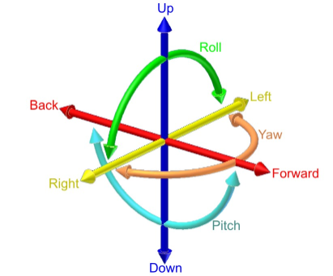

-----

| Title     | RL Robot                                              |
| --------- | ----------------------------------------------------- |
| Created @ | `2023-11-21T07:46:49Z`                                |
| Updated @ | `2023-11-21T07:52:17Z`                                |
| Labels    | \`\`                                                  |
| Edit @    | [here](https://github.com/junxnone/aiwiki/issues/458) |

-----

# Robot 基础知识

  - **刚体(Rigid body)**: 假设质点系里的所有质点都是相对静止的，也就是整个系统没有任何形变，那么这个系统是一个理想刚体
  - 自由度(DOF - Degrees-of-Freedom): 完全描述刚体位置需要的维度
      - 三维空间 自由运动刚体 自由度为 6 `A(x, y, z) B(m, n) C(α)` 或者 平移与旋转 - `(x, y,
        z, α, β, γ)`
      - 二维空间 自由运动刚体 自由度为 3 `A(x, y) B(α)`
  - 位形空间(C-Space - Configuration space)
  - 拓扑
  - 旋转

## Reference

  - [入门机器人需要的基础知识](https://zhuanlan.zhihu.com/p/655770237)
