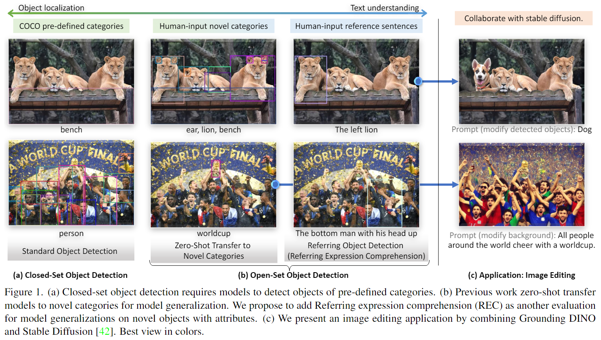

-----

| Title     | paper GroundingDINO                                   |
| --------- | ----------------------------------------------------- |
| Created @ | `2024-04-26T07:30:30Z`                                |
| Updated @ | `2024-07-25T02:47:54Z`                                |
| Labels    | \`\`                                                  |
| Edit @    | [here](https://github.com/junxnone/aiwiki/issues/464) |

-----

# Grounding DINO

## 简介

  - **目标:** Referring Expression Comprehension (REC)
    指称表达理解(特定的带形容词的object/短语理解)

## 现状

  - 现有的开放集检测器架构
      - 用于提取特征的 Backbone
      - 用于增强特征的 Neck
      - 用于区域细化或检测区域的 Head
      - 特征融合一般在 Neck ，Qury Init 或Head 三种中的一种
  - 现有的开放集检测器大都倾向于检测新类别

## 架构

  - 基于 类 DETR 模型 DINO: Text Encoder + Image Encoder + Feature Enhancer +
    Cross-Modality Decoder
      - Image Backbone: Swin-T/Swin-L
      - Text Backbone: BERT-base
  - 三种特征融合方法 Neck ，Qury Init 或Head
      - Neck: 堆叠自注意力，文本-图像交叉注意力，图像-文本注意力模块的特征增强器
      - Qury Init：语言引导的查询模式
      - Head：带图像-文本交叉注意力，可以增强查询表示的跨模态解码器
  - Sub-sentence level representation (Attention masks)

## 结果

  - COCO Benchmark
      - 同样设置的话(O365 训练，COCO 测试) 比 DINO/GLIP 略好
      - 增加 Grounding data(GoldG/Cap4M/OI/RefC) 也可以获取更好的结果
  - LVIS Benchmark
      - 整体 AP 优于GLIP, 在 rare 类别表现较差
      - 通过 Cap4M 数据集的增益优于GLIP
  - ODinW Benchmark
      - zero-shot/few-shot/full-shot 都较优
      - full-shot: 使用 Swin-T Backbone 仍优于使用 Swin-L Backbone 的 DINO
      - zero-shot: 优于 GLIP ，和GLIPv2 相当
  - RefCOCO/+/g
  - Ablations 消融实验: w/o Encoder Fusion/Query Selection/Text Cross
    Attention/Word-level Text prompt, 都有不同程度的drop

## Reference

  - [Grounding DINO: Marrying DINO with Grounded Pre-Training for
    Open-Set Object Detection](https://arxiv.org/abs/2303.05499)
