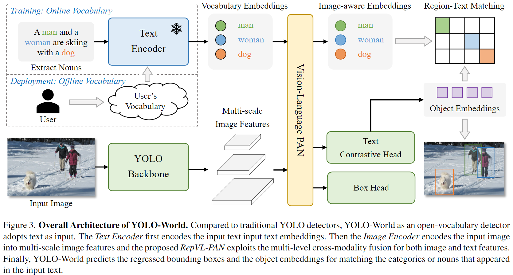
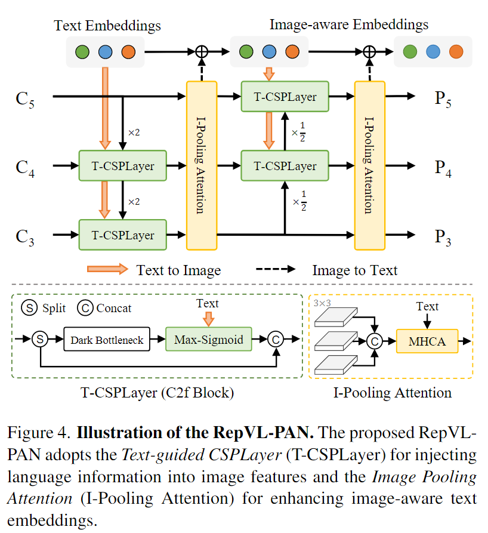
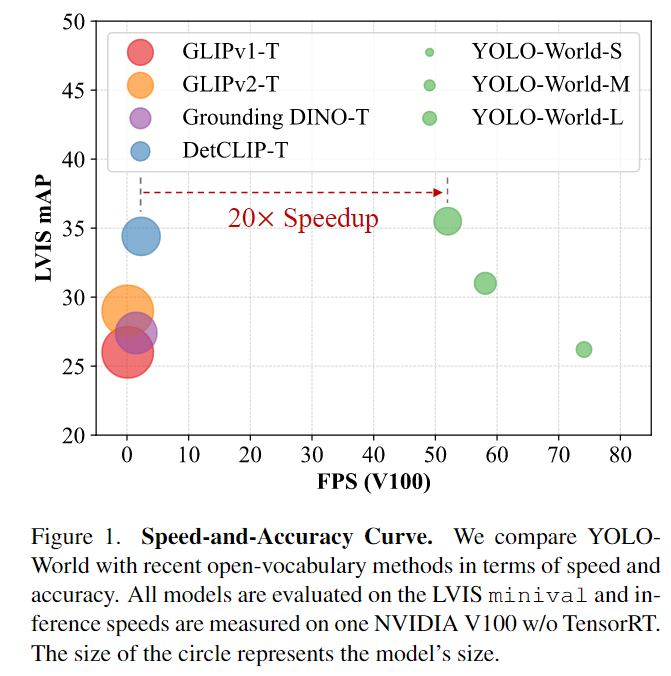

-----

| Title     | paper YOLOWorld                                       |
| --------- | ----------------------------------------------------- |
| Created @ | `2024-04-26T07:46:01Z`                                |
| Updated @ | `2024-04-26T07:49:46Z`                                |
| Labels    | \`\`                                                  |
| Edit @    | [here](https://github.com/junxnone/aiwiki/issues/465) |

-----

# YOLO-World

  - 基于 [ Ultralytics
    YOLOv8](https://docs.ultralytics.com/models/yolov8/) 的
    [开放词汇目标检测/`Open Vocabulary Object Detection -
    OVOD`](https://paperswithcode.com/task/open-vocabulary-object-detection)
  - 训练时使用开放词汇，部署时使用离线词汇(用户的固定词汇)

## 现状

  - Open-Vocabulary Object Detection(OVD) 开放词汇目标检测

  - 预定义和训练时需要类别限制了在开放场景中的适应性

  - 引入 VLM 和在大规模数据集上预训练增强 YOLO 的词汇检测能力
    
      - RepVL-PAN: Re-parameterizable VisionLanguage Path Aggregation
        Network
      - 区域-文本 对比损失

  - 目前的开放词汇检测器存在的问题：
    
      - 计算负担比较重
      - 边缘设备部署复杂

  - YOLO-world 高效易部署
    
      - 部署过程中可以删除 Text-Encoder, 使用 Text embedding 部署

  - 联合 Detection Data/Grounding Data/Image-Text Data

  - Prompt-then-Detect 模式: 对用户的 Prompts 编码 构建离线词汇(可根据需求改变) 

  - LVIS: 35.4 AP 52 FPS

  - 下游任务
    
      - Segmentation
      - Referring Object Detection

## 相关工作

  - Input: Image & Text
    
      - Region-Text Pairs: 类别名称/名词短语/对象描述

  - Output: Bbox & object embedding

### 模型架构

    *   Image Encoder(Darknet Backbone - YOLOv8 Detector)
    *   Text Encoder(CLIP): Frozen
    *   n-gram 算法提取名词短语
    *   Text Contrastive Head
    *   RepVL-PAN(增强文本和图像表示)
    
        *   T-CSPLayer: Text-guided Cross Stage Partial Layer : Text info --> Image feature&#x20;
        *   max-sigmoid attention
        *   I-Pooling Attention(Image Pooling Attention)

### 预训练方法

    *   Total Loss = Contrastive Loss + λ \*  (IoU Loss + Distributed Focal Loss)
    *   Pseudo Labeling:&#x20;
    *   利用 n-gram 提取名词短语
    *   利用 OVD(GLIP) 生成 Pseudo Boxes 提供初略的区域-文本对
    *   采用预训练的 CLIP 来 评估 image-text /region-text 对，过滤掉低相关性的标记
    *   NMS 过滤冗余BBox
    *   Traing Datasets: Object365/GQA/Flickr/CC3M
    *   Test Datasets: LVIS/COCO

### 测试结果

  - 和 GLIP-T/GLIPv2-t/Grounding DINO-T/DetCLIP-T 等轻 Backbone
    网络比较，获得了较好的性能
  - **消融实验**: 更丰富的文本信息/RepVL-PAN/Frozen CLIP Text Encoder 都能取得较好的性能提升

## YOLO World S/M/L/X/XL and v1/v2

  - `S/M/L/X` config 文件中使用了不同的 `YOLO v8 S/M/L/X`, 其他均相同
  - **YOLO-World v2**
      - 移除了 `I-PoolingAttention`: 该部分可以提升在 LVIS 上的 zero-shot 性能，但是会影响
        ONNX/TensorRT 上的 Inference 速度
      - 替换了 `contrastive head` 中的 `L2-Norm` 为 `BatchNorm`: `L2-Norm`
        中包含如 `reduce` 等耗时的操作，影响部署时的性能.

## Reference

  - [YOLO-World Model](https://docs.ultralytics.com/models/yolo-world/)
  - [Code](https://github.com/AILab-CVC/YOLO-World)
  - [yolo-world-s/m/l/x weights - hugging
    face](https://huggingface.co/wondervictor/YOLO-World/tree/main)
