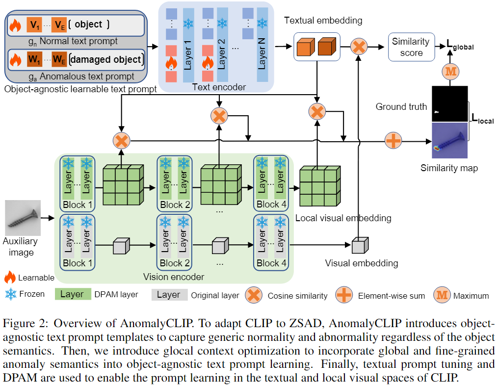

-----

| Title     | paper AnomalyCLIP                                     |
| --------- | ----------------------------------------------------- |
| Created @ | `2024-04-26T07:52:00Z`                                |
| Updated @ | `2024-04-26T07:52:00Z`                                |
| Labels    | \`\`                                                  |
| Edit @    | [here](https://github.com/junxnone/aiwiki/issues/466) |

-----

# AnomalyCLIP

  - CLIP 在 ZSAD(Zero-shot anomaly detection) 表现不好的原因是 VLM 更关注前景对象的类语义
  - 通用可学习的与物体种类无关的 `text prompt`
  - 利用全局和局部上下文优化模块，来学习泛化能力更好的Prompt
  - `text prompt tuning`
  - DPAM - `Diagonally Prominent Attention Map`
  - 视觉encoder的多个中间层和文本embedding对齐，以此获得局部视觉信息

## Arch

  - Backbone: `VIT-L/14@336px` 模型参数 frozen

## Text Prompts

  - `object-aware text prompt templates`
  - `object-agnostic text prompt templates`

<!-- end list -->

    prompt_normal = ['{}', 'flawless {}', 'perfect {}', 'unblemished {}', '{} without flaw', '{} without defect', '{} without damage']
    prompt_abnormal = ['damaged {}', 'broken {}', '{} with flaw', '{} with defect', '{} with damage']

  - [prompt
    code](https://github.com/zqhang/AnomalyCLIP/blob/e0741d81c3dd4bec4c3fdf124b4091cda021e087/prompt_ensemble.py#L57-L79)

## Test

  - 提供了两个预训练模型
      - 在 `MVTec AD` 数据集上训练模型，测试其他数据集
      - 在 `VisA` 数据集上训练模型，测试 `MVTec AD`

# Reference

  - \[[AnomalyCLIP: Object-agnostic Prompt Learning for Zero-shot
    Anomaly Detection](https://arxiv.org/pdf/2310.18961.pdf)\]
    \[[code](https://github.com/zqhang/AnomalyCLIP)\]
