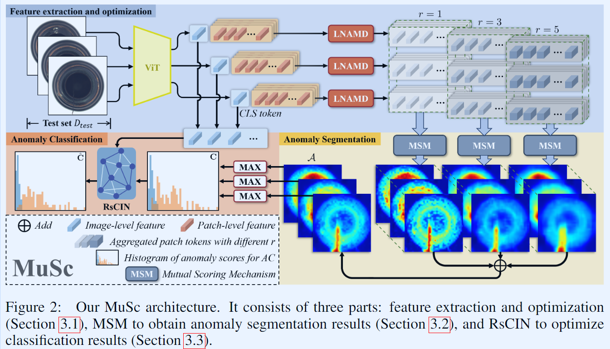

-----

| Title     | paper MuSC                                            |
| --------- | ----------------------------------------------------- |
| Created @ | `2024-05-15T01:15:06Z`                                |
| Updated @ | `2024-05-15T01:15:06Z`                                |
| Labels    | \`\`                                                  |
| Edit @    | [here](https://github.com/junxnone/aiwiki/issues/467) |

-----

# MuSC

  - MuSc - `Mutual Scoring`
  - 以往的方法基于CLIP的图文对齐能力和SAM的提示工程，忽略了无标签测试图像本身蕴含的丰富正常先验信息。
  - 在工业产品图像中，异常像素统计占比较少
      - Patch-Level 图像的正常区域可以在其他无标注的图像中找到相对大量的相似的正常区域，而异常区域只能找到少量相似的区域
  - 可以通过统计学来区分 patch-level 的异常
  - 对无标注的图像进行相互打分，正常区域会被赋予较低的分数，异常区域会被赋予较高的分数。
  - **该方法不需要任何辅助数据集进行训练，也不需要额外的文本模态进行提示。**

## Arch

  - Image Encoder(ViT)
  - LNAMD: 优化 Patch-Level features, 适配不同 size 的异常
  - MSM：Patch-Level 评分，生成 mask
  - RsCIN 优化 Image-Level 的性能

### LNAMD

  - Local Neighborhood Aggregation with Multiple Degrees 
      - 多聚合度邻域聚合模块
      - 获取能够表征不同大小缺陷的区域级特征
  - 使用不同聚合度(1/3/5) 聚合 `r x r` 邻域 patch, 获取 聚合 patch token

### MSM

  - Mutual Scoring Mechanism 
      - 互打分模块
      - 用无标注图像进行相互打分，分数越高表示该图像区域异常概率越大。
  - 如果图片 i 中的 patch token 与 图片 j 中的任意 patch token 相似，则图片 j 给 图片 i 的
    patch token 一个较低的 `anomaly score`
  - 统计图片 i 的 patch 的在数据集中所有图片的评分，创建 histogram
      - normal/abnormal patch 有不同的分布 
  - 通过去除大值(取较小区间的评分)的方式减少重叠部分，用以区分 normal/abnormal

### RsCIN

  - Re-scoring with Constrained Image-level Neighborhood 
      - 图像级受限邻域的重打分 分类优化模块
      - 优化分类结果，减少噪声带来的误检
  - Manifold learning: 构建新的嵌入空间使距离度量和`manifold structure` 匹配
  - MMO：Multi-window Mask Operation
      - 约束图片数量，提升 image-level 异常分类
  - Image-Level 的特征适合 `高维 Manifold` 

## Inference

  - 推理时间较长：在较好效果的 ViT-L-14-336 上 955ms @ `NVIDIA RTX 3090`
    \[[Reference](https://github.com/xrli-U/MuSc/blob/main/README_cn.md#%E6%8E%A8%E7%90%86%E6%97%B6%E9%97%B4-%E8%BF%94%E5%9B%9E%E7%9B%AE%E5%BD%95)\]
  - 实时推理性能计算方法？？`目前的Inference 方式类似于 batch Inference, 必须有一定数量的图片一起
    Inference`

## Performance

| Backbones         | Pre-training | image size | AUROC-cls | F1-max-cls | AP-cls | AUROC-segm | F1-max-segm | AP-segm | PRO-segm | Inference times(ms/image) |
| ----------------- | ------------ | ---------- | --------- | ---------- | ------ | ---------- | ----------- | ------- | -------- | ------------------------- |
| ViT-B-32          | CLIP         | 256        | 87.99     | 92.31      | 94.38  | 93.08      | 42.06       | 37.21   | 72.62    | 48.33                     |
| dino\_vitbase16   | DINO         | 256        | 89.39     | 93.77      | 95.37  | 95.83      | 54.02       | 52.84   | 84.24    | 85.97                     |
| ViT-B-32          | CLIP         | 512        | 89.91     | 92.72      | 95.12  | 95.73      | 53.32       | 52.33   | 83.72    | 95.74                     |
| ViT-B-16          | CLIP         | 256        | 92.78     | 93.98      | 96.59  | 96.21      | 52.48       | 50.23   | 87       | 86.68                     |
| dino\_vitbase16   | DINO         | 512        | 94.11     | 96.13      | 97.26  | 97.78      | 62.07       | 63.2    | 92.49    | 458.5                     |
| ViT-B-16          | CLIP         | 512        | 94.2      | 95.2       | 97.34  | 97.09      | 61.24       | 61.45   | 91.67    | 450.5                     |
| ViT-B-16-plus-240 | CLIP         | 240        | 94.77     | 95.43      | 97.6   | 96.26      | 52.23       | 50.27   | 87.7     | 85.25                     |
| dinov2\_vitb14    | DINO\_v2     | 336        | 95.67     | 96.8       | 97.95  | 97.74      | 60.23       | 59.45   | 93.84    | 209.1                     |
| ViT-B-16-plus-240 | CLIP         | 512        | 95.69     | 96.5       | 98.11  | 97.28      | 60.71       | 61.29   | 92.14    | 506.4                     |
| ViT-L-14          | CLIP         | 518        | 95.94     | 96.32      | 98.3   | 97.42      | 63.06       | 63.67   | 92.92    | 933.3                     |
| ViT-L-14          | CLIP         | 336        | 96.06     | 96.65      | 98.25  | 97.24      | 59.41       | 58.1    | 91.69    | 266                       |
| dinov2\_vitb14    | DINO\_v2     | 518        | 96.31     | 96.87      | 98.32  | 98.07      | 64.65       | 65.31   | 95.59    | 755                       |
| ViT-L-14-336      | CLIP         | 336        | 96.4      | 96.44      | 98.3   | 97.03      | 57.51       | 55.44   | 92.18    | 270.2                     |
| dinov2\_vitl14    | DINO\_v2     | 336        | 96.84     | 97.45      | 98.68  | 98.17      | 61.77       | 61.21   | 94.62    | 281.4                     |
| dinov2\_vitl14    | DINO\_v2     | 518        | 97.08     | 97.13      | 98.82  | 98.34      | 66.15       | 67.39   | 96.16    | 1015.1                    |
| ViT-L-14-336      | CLIP         | 518        | 97.77     | 97.37      | 99.07  | 97.11      | 62.16       | 62.26   | 93.45    | 955.3                     |

## Q?

-----

  - 是不是可以通过数据集获取固定的 `评委` ？通过 Online 纠错，更新 `评委` 来增强 MuSC 能力？
  -
