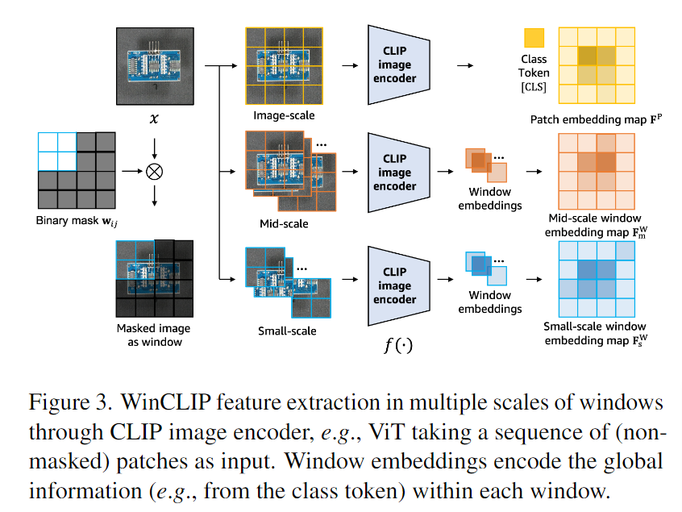

-----

| Title     | paper WinCLIP                                         |
| --------- | ----------------------------------------------------- |
| Created @ | `2024-06-13T01:21:32Z`                                |
| Updated @ | `2024-06-14T02:57:33Z`                                |
| Labels    | \`\`                                                  |
| Edit @    | [here](https://github.com/junxnone/aiwiki/issues/468) |

-----

# WinCLIP

  - 通过使用手动设计的状态词和提示词模板关联异常/正常样本
  - **Compositional Prompt Ensemble** -\> `Anomaly Classification`
  - **window-based CLIP** -\> `Anomaly Segmentation`
  - **WinCLIP+** -\> Few shot

## Arch

  - **CLIP-AC**
      - 基于 OpenCLIP 实现的的二分类异常检测框架
      - prompts: `normal [o]` / `anomalous [o]`
  - **CPE** - `Compositional prompt ensemble`
      - **state words**;
          - `perfect/flawless/unblemished/without faw/without
            defect/without damage`
          - `damaged/with flaw/with defect/with damage/...`
      - **Text Template**
          - `a cropped photo of the {}`
          - `a close-up photo of a {}`
          - `a photo of the {}`
          - ...
  - CPE 生成的一些列 prompt 的 `text embedding` 进行 `Group Average` 和 `image
    embedding` 计算相似度生成 AC Score
  - **Window-based**
      - 通过 `sliding window` 生成 mid-scale/small-scale patch
      - 各 patch 分别通过 image encode 生成 window embedding ，组合成 mid/small
        embedding map
      - mid/small embedding map 分别和 text embedding 
  - **Harmonic aggregation**
      - 每个窗口获取一个异常分数，将这个分数分散到所有window 中的 像素
      - 聚合 `overlapping` 处的多个分数, 通过 `armonic averaging` /`加权` 提升分割性能
  - **Multi-scale Aggeration**
      - 为了提升检测的多尺度能力，聚合多尺度的检测结果

## anomalib Impl

### Zero-Shot

  - 计算 image score, 即 `image_embeddings` 和 `text_embeddings` 的余弦距离，再进行
    softmax

<iframe frameborder="0" scrolling="no" style="width:100%; height:142px;" allow="clipboard-write" src="https://junxnone.github.io/emgithub/iframe.html?target=https%3A%2F%2Fgithub.com%2Fopenvinotoolkit%2Fanomalib%2Fblob%2F56843d2671977d07ad228e6e5d870bf7f240cf59%2Fsrc%2Fanomalib%2Fmodels%2Fimage%2Fwinclip%2Futils.py%23L95-L97&style=agate&type=code&showBorder=on&showLineNumbers=on&showFileMeta=on&showFullPath=on&showCopy=on"></iframe>

  - 计算 Pixel Anomaly Map, 即 每个 `window_embeddings` 和 `text_embeddings`
    计算余弦距离，并聚合

<iframe frameborder="0" scrolling="no" style="width:100%; height:226px;" allow="clipboard-write" src="https://junxnone.github.io/emgithub/iframe.html?target=https%3A%2F%2Fgithub.com%2Fopenvinotoolkit%2Fanomalib%2Fblob%2F22caf3badf610641c6b0d4f7ba5d6e1b1e419ce8%2Fsrc%2Fanomalib%2Fmodels%2Fimage%2Fwinclip%2Ftorch_model.py%23L275-L281&style=agate&type=code&showBorder=on&showLineNumbers=on&showFileMeta=on&showFullPath=on&showCopy=on"></iframe>

### Few-Shot

  - pixel/image level score 分别 计算 few-shot branch 和 zero-shot 的均值 作为最终值

<iframe frameborder="0" scrolling="no" style="width:100%; height:142px;" allow="clipboard-write" src="https://junxnone.github.io/emgithub/iframe.html?target=https%3A%2F%2Fgithub.com%2Fopenvinotoolkit%2Fanomalib%2Fblob%2F22caf3badf610641c6b0d4f7ba5d6e1b1e419ce8%2Fsrc%2Fanomalib%2Fmodels%2Fimage%2Fwinclip%2Ftorch_model.py%23L243-L245&style=agate&type=code&showBorder=on&showLineNumbers=on&showFileMeta=on&showFullPath=on&showCopy=on"></iframe>

  - Pixel Anomaly Map, 聚合 `patch_embedings`, `window_embeddings` 的余弦相似度

<iframe frameborder="0" scrolling="no" style="width:100%; height:352px;" allow="clipboard-write" src="https://junxnone.github.io/emgithub/iframe.html?target=https%3A%2F%2Fgithub.com%2Fopenvinotoolkit%2Fanomalib%2Fblob%2F22caf3badf610641c6b0d4f7ba5d6e1b1e419ce8%2Fsrc%2Fanomalib%2Fmodels%2Fimage%2Fwinclip%2Ftorch_model.py%23L304-L316&style=agate&type=code&showBorder=on&showLineNumbers=on&showFileMeta=on&showFullPath=on&showCopy=on"></iframe>

## Reference

  - [深度学习论文: WinCLIP: Zero-/Few-Shot Anomaly Classification and
    Segmentation](https://blog.csdn.net/shanglianlm/article/details/132432407)
