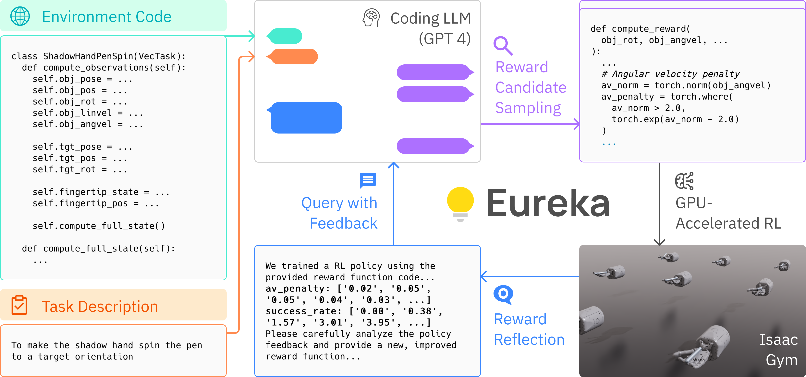

-----

| Title     | paper Eureka                                          |
| --------- | ----------------------------------------------------- |
| Created @ | `2024-06-22T09:43:36Z`                                |
| Updated @ | `2024-06-22T09:43:36Z`                                |
| Labels    | \`\`                                                  |
| Edit @    | [here](https://github.com/junxnone/aiwiki/issues/470) |

-----

# Eureka

  - **Eureka** - `Evolution-driven Universal REward Kit for Agent`
  - 使用 LLMs(GPT-4) 生成 RL 中的奖励函数(替代手动设计激励函数)
      - 没有预定义激励函数模板
  - curriculum learning
  - RLHF 微调激励函数
  - Input
      - 原始环境源代码(没有 reward code)
      - 任务描述
  - Output
      - 奖励函数

## Arch

## python package Eureka

  - 使用 GPT4, 需要 `OpenAI API Key`
      - 需要用[虚拟 SMS 服务](https://sms-activate.org/)，充值最少 `2＄`(印度尼西亚
        虚拟号码使用一次约 `0.11＄`)
      - 注册 OpenAI 后约 `5 ＄` 的免费使用额度

## Reference

  - [paper **Eureka**: Human-Level Reward Design via Coding Large
    Language Models](https://arxiv.org/abs/2310.12931)
  - [Code](https://github.com/eureka-research/Eureka)
