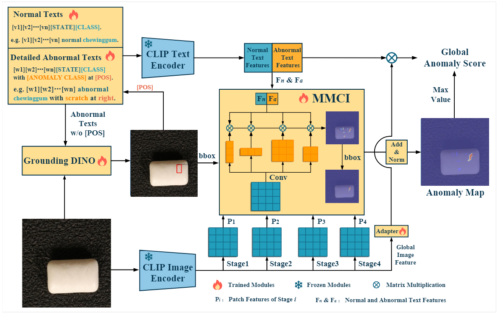
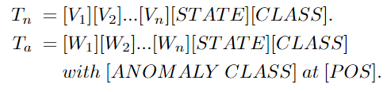
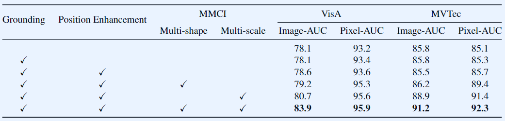

-----

| Title     | paper FiLo                                            |
| --------- | ----------------------------------------------------- |
| Created @ | `2024-07-25T02:18:10Z`                                |
| Updated @ | `2024-08-19T08:34:06Z`                                |
| Labels    | \`\`                                                  |
| Edit @    | [here](https://github.com/junxnone/aiwiki/issues/472) |

-----

# FiLo

  - 增加了 LLMs 来生成异常描述信息
  - 增加了 Grounding DINO 来生成 位置信息
  - CLIP Backbone: `ViT-L-14-336px`
  - GroundingDINO - `Swin-T`

## Arch

  - FG-Des
      - Adaptively Learned Text Templates
      - Fine - Grained Anomaly Descriptions
  - HQ-Loc
      - Grounding DINO Preliminary Localization
      - Position - Enhanced Textual Prompt
      - MMCI
  - Adapter：使用瓶颈结构的Adapter对齐全局图像特征和文本特征
  - Loss Functions：选择交叉熵损失和Focal损失、Dice损失来优化全局异常分数和异常图，通过平衡超参数计算最终损失

### 自适应文本模板

  - \[V\] \[W\] 代表可学习文本向量
  - \[STATE\] 使用 `normal/abnormal`
  - \[CLASS\] 使用 `category`
  - \[ANOMALY CLASS\] 使用 LLMs 生成的异常描述
  - \[POS\] 使用 Grounding DINO 生成的 `位置信息`

### MMCI

  - **Multi** - Scale **Multi** - Shape **Cross** - Modal
    **Interaction** Module
  - Multi-Shape : 不同形状的 卷积核 - `1x1/3x3/5x5/7x7/1x5/5x1`

### Image-Level Score

1.  首先，将细粒度异常类型的文本输入到Grounding DINO中，以获得异常定位的初步边界框。
2.  同时，将细粒度异常类型与先前学习的文本向量模板相结合，生成正常和异常情况的文本描述，并将这些描述输入到CLIP Text
    Encoder中进行特征提取，得到正常和异常文本特征，表示为 $(F = \[F\_n, F\_a\] \\in R^{2
    \\times C})$
3.  图像经过CLIP Image Encoder提取中间块特征 $(P\_i \\in R^{H\_iW\_i \\times C})$
    ，从 $(M)$个阶段中获取。
4.  将图像的全局特征通过线性适配器层，得到与文本内容更匹配的适应图像特征 $(A \\in R^C)$ 。
5.  最后，通过公式 $(S\_{global} = softmax(A \\cdot F\_a^T) +
    max(M))$计算全局异常分数，其中 $(M)$是在第3.3节中计算的异常图，
    $(max(\\cdot))$表示取最大值操作。

综上所述，FiLo通过结合图像特征和文本特征，利用上述公式计算得到图像级别的异常分数。

### Anomaly Map

Anomaly Map（异常图）的计算过程如下：

1.  首先，使用不同形状的卷积核（如1×1、3×3、5×5、1×5、5×1、9×9等）对CLIP图像编码器提取的中间块特征 $(P\_i
    \\in R^{H\_iW\_i \\times C})$进行并行处理，其中(i)表示第(i)个阶段。
2.  对于位置增强的文本特征 $(\[F\_n, F\_a\] \\in R^{2 \\times C})$和块特征
    $(P\_i)$，通过公式
    $(M\_{i}^{n},M\_{i}^{a}=Up(Norm(\\sum\_{j=1}^{n}S(C\_{j}(P\_{i})\\cdot
    \[F\_{n},F\_{a}\]^{T}))))$计算正常图 $(M\_{i}^{n})$和异常图
    $(M\_{i}^{a})$。其中， $(Up(\\cdot))$表示上采样操作，
    $(S(\\cdot))$是softmax操作， $(Norm(\\cdot))$代表归一化操作，确保异常图中的值在0和1之间。
3.  通过对每一层的 $(M\_i)$进行求和并归一化，得到正常图和异常图： $(M^{n}=Norm(\\sum\_{i}
    M\_{i}^{n}))$， $(M^{a}=Norm(\\sum\_{i} M\_{i}^{a}))$。
4.  最终的定位结果通过公式 $(M=G\_{\\sigma}(M^{a}+1-M^{n})/2)$计算，其中
    $(G\_{\\sigma})$是一个高斯滤波器， $(\\sigma)$控制平滑程度。

综上所述，通过以上步骤计算得到Anomaly Map。

## 性能评估

  - MMCI 提供了最大的增长

## Reference

  - [FiLo: Zero-Shot Anomaly Detection by Fine-Grained Description and
    High-Quality Localization](https://arxiv.org/abs/2404.13671)
