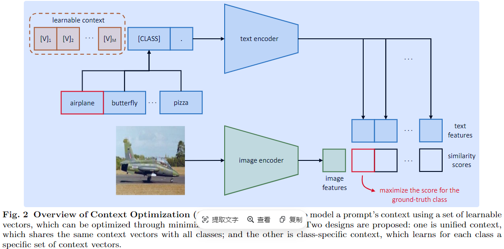

-----

| Title     | paper CoOP                                            |
| --------- | ----------------------------------------------------- |
| Created @ | `2024-10-08T03:31:04Z`                                |
| Updated @ | `2024-10-16T09:21:55Z`                                |
| Labels    | \`\`                                                  |
| Edit @    | [here](https://github.com/junxnone/aiwiki/issues/474) |

-----

# CoOP

  - Context Optimization(CoOP) - 通过自动优化提示词，提高 VLM 模型下游任务的性能，减少人工提示工程的工作量
  - **PET** `Prompt` --\> `Best pizza ever! It was ___`
  - **AutoPrompt** --\> `  [T] [T] [T] [T] [T] [P] `
  - **CLIP** --\> `A photo of a {CLASS}` :: `[Image]`
  - **CoOP** --\> `[V] [V] [V] [V] [V] [CLASS]` :: `[Image]`
  - AnomlyCLIP/FILo 等异常检测使用了 CoOP 方法

## CoCoOP

  - 解决 CoOp 方法中学习到的上下文无法推广到同一数据集中未见过的类别的问题。
  - 条件提示学习，使提示能够根据每个输入实例进行调整，提高模型的泛化能力
  - 在 CoOp 的基础上，进一步学习一个轻量级神经网络，为每个图像生成一个输入条件令牌（向量），与可学习的上下文向量相结合。

## CoCoOP vs CoOP

## Reference

  - [Conditional Prompt Learning for Vision-Language
    Models](https://arxiv.org/abs/2203.05557)
  - [Learning to Prompt for Vision-Language
    Models](https://arxiv.org/abs/2109.01134)
