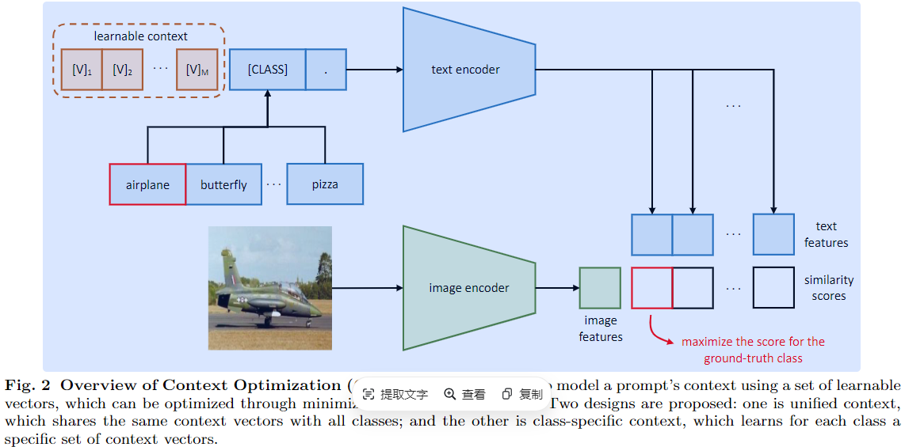

-----

| Title     | x CoOP                                                |
| --------- | ----------------------------------------------------- |
| Created @ | `2024-10-08T03:31:04Z`                                |
| Updated @ | `2024-10-08T03:31:04Z`                                |
| Labels    | \`\`                                                  |
| Edit @    | [here](https://github.com/junxnone/aiwiki/issues/474) |

-----

# CoOP

  - Context Optimization(CoOP) - 通过自动优化提示词，提高 VLM 模型下游任务的性能，减少人工提示工程的工作量
  - **PET** `Prompt` --\> `Best pizza ever! It was ___`
  - **AutoPrompt** --\> `  [T] [T] [T] [T] [T] [P] `
  - **CLIP** --\> `A photo of a {CLASS}` :: `[Image]`
  - **CoOP** --\> `[V] [V] [V] [V] [V] [CLASS]` :: `[Image]`
  - AnomlyCLIP/FILo 等异常检测使用了 CoOP 方法

