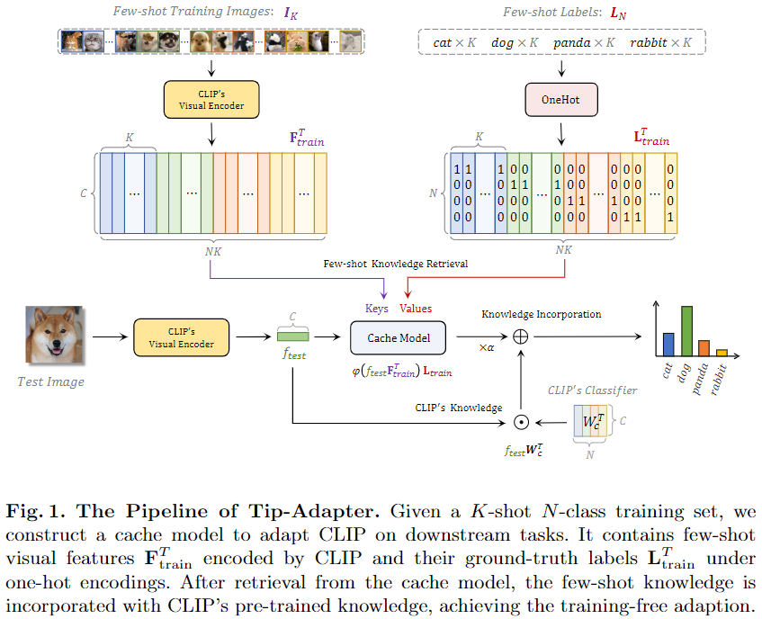

-----

| Title     | x TipAdapter                                          |
| --------- | ----------------------------------------------------- |
| Created @ | `2024-10-09T01:53:49Z`                                |
| Updated @ | `2024-10-09T01:53:50Z`                                |
| Labels    | \`\`                                                  |
| Edit @    | [here](https://github.com/junxnone/aiwiki/issues/475) |

-----

# Tip-Adapter

  - 利用 CLIP 构建 Cache Model, 结合 CLIP 的输出综合生成结果

## Reference

  - [Tip-Adapter: Training-free Adaption of CLIP for Few-shot
    Classification](https://arxiv.org/pdf/2207.09519)
