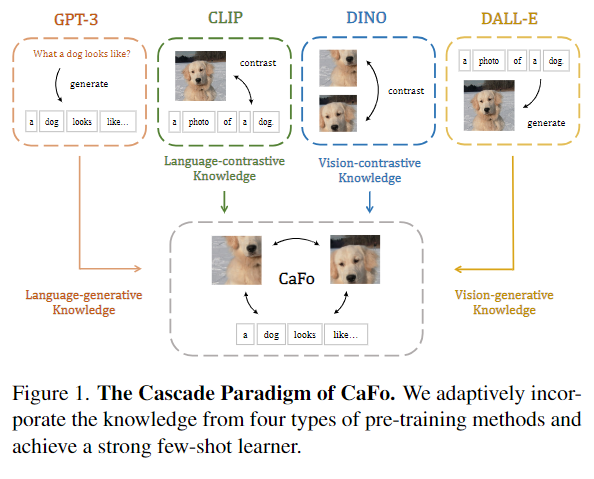
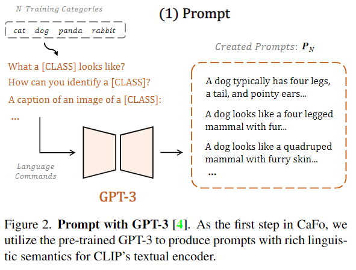
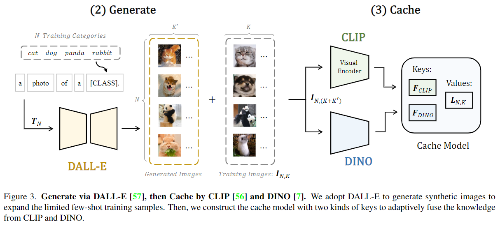
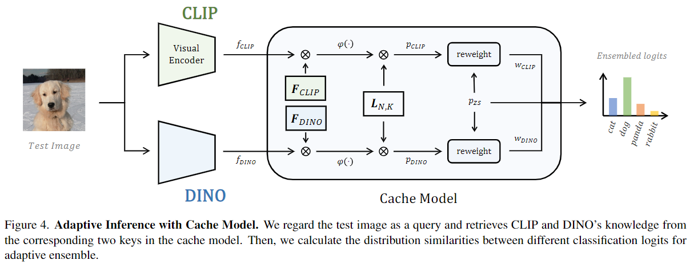

-----

| Title     | x CaFo                                                |
| --------- | ----------------------------------------------------- |
| Created @ | `2024-10-11T01:52:10Z`                                |
| Updated @ | `2024-10-11T01:52:10Z`                                |
| Labels    | \`\`                                                  |
| Edit @    | [here](https://github.com/junxnone/aiwiki/issues/476) |

-----

# CaFo

  - 分别利用 GPT-3/CLIP/DINO/DALL-E 从 Prompt/Generate/CacheModel 方面提升模型性能

## Arch

  - 1 利用 GPT-3 生成更丰富语义的 Prompt
  - 2 利用 DALL-E 生成 Prompt 相关的 Image
  - 3 将生成的 Image 和 Training Image 使用 CLIP & DINO 生成 Cache Model
  - 4 **Inference** 测试图片通过 CLIP & DINO 生成查询 keys, 从 Cache Model 中获取
    ensemble 结果

## Reference

  - [Prompt, Generate, then Cache: Cascade of Foundation Models makes
    Strong Few-shot Learners](https://arxiv.org/abs/2303.02151)
  - [Code](https://github.com/OpenGVLab/CaFo)
