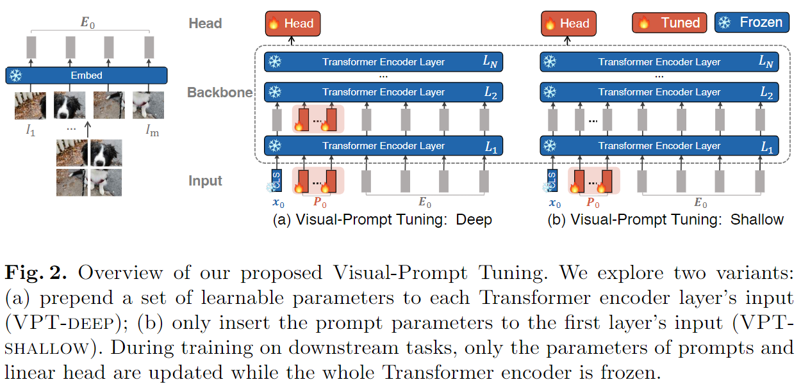

-----

| Title     | paper VPT                                             |
| --------- | ----------------------------------------------------- |
| Created @ | `2024-10-11T02:20:05Z`                                |
| Updated @ | `2024-10-16T09:11:29Z`                                |
| Labels    | \`\`                                                  |
| Edit @    | [here](https://github.com/junxnone/aiwiki/issues/477) |

-----

# VPT - Visual Prompt Tuning

  - 在 Transformer 层中插入输入可学习参数
  - **VPT-deep**: 每一层 Transformer 编码器层输入中添加一组可学习参数
  - **VPT-shallow**: 仅在第一个 Transformer 编码器层输入中插入参数
  - 针对下游任务，只需存储部分参数

对于一个具有(N)层的普通视觉Transformer（ViT）\[19\]，输入图像被划分为(m)个固定大小的 patches（小块）
$({I\_{j} \\in \\mathbb{R}^{3 ×h ×w} | j \\in \\mathbb{N}, 1 ≤j ≤m})$
。(h)、(w)分别是图像小块的高度和宽度。然后，每个小块首先通过位置编码嵌入到(d)维潜在空间中：
$(e\_{0}^{j}=Embed\\left(I\_{j}\\right) e\_{0}^{j} \\in \\mathbb{R}^{d},
j = 1,2, \\ldots m)$。（1）

## Arch

## VPT - Shallow

  - 提示仅插入到第一个Transformer层 $(L\_{1})$ 中。
  - 每个提示标记是一个可学习的 $( d)$ 维向量。 $( p)$ 个提示的集合表示为 $( P = {p^{k} \\in
    \\mathbb{R}^{d} | k \\in \\mathbb{N}, 1 ≤ k ≤ p})$
  - 结构:
      - $\\left\[x\_{1}, Z\_{1}, E\_{1}\\right\] =
        L\_{1}\\left(\\left\[x\_{0}, P, E\_{0}\\right\]\\right)$
      - $\\left\[x\_{i}, Z\_{i}, E\_{i}\\right\] =
        L\_{i}\\left(\\left\[x\_{i - 1}, Z\_{i - 1}, E\_{i -
        1}\\right\]\\right) i = 2,3, \\ldots, N$
      - $y = Head\\left(x\_{N}\\right)$
      - 其中 $( Z\_{i} \\in \\mathbb{R}^{p ×d})$ 表示第 $( \\dot{z})$
        个Transformer层计算出的特征，并且 $( \[x\_{i}, Z\_{i}, E\_{i}\] \\in
        \\mathbb{R}^{(1 + p + m) ×d})$ 。

## VPT-Deep

  - 在每个Transformer层的输入空间中引入提示。对于第 $(i + 1)$ 层 $L\_{i + 1}$
    ，我们将输入的可学习提示的集合表示为 $P\_{i}={p\_{i}^{k}
    \\in \\mathbb{R}^{d} | k \\in \\mathbb{N}, 1 ≤ k ≤ m}$ 。
  - 结构：
      - $\\left\[x\_{i}, \_, E\_{i}\\right\]=L\_{i}\\left(\\left\[x\_{i
        - 1}, P\_{i - 1}, E\_{i - 1}\\right\]\\right) i = 1,2, \\ldots,
        N$
      - $y = Head\\left(x\_{N}\\right)$

## Reference

  - [Visual Prompt Tuning](https://arxiv.org/abs/2203.12119)
