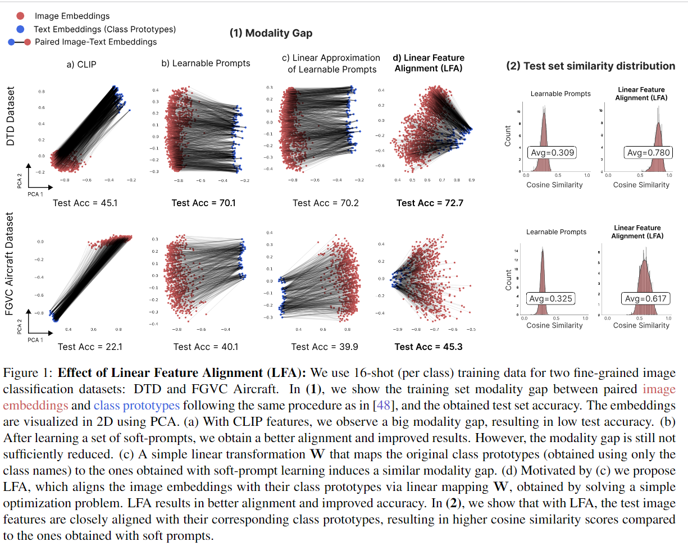

-----

| Title     | x LFA                                                 |
| --------- | ----------------------------------------------------- |
| Created @ | `2024-10-11T05:12:02Z`                                |
| Updated @ | `2024-10-11T07:37:31Z`                                |
| Labels    | \`\`                                                  |
| Edit @    | [here](https://github.com/junxnone/aiwiki/issues/480) |

-----

# LFA

  - Linear Feature Alignment 重新对齐视觉语言特征
  - 通过最小二乘法问题的闭式解进行初始化，然后通过最小化重排序损失进行迭代更新

## Arch

### Approximating Soft Prompts with a Linear Transformation

  - 设 $Y \\in \\mathbb{R}^{C ×d}$ 是以矩阵形式表示的类名嵌入
  - 设 $Y' \\in \\mathbb{R}^{C ×d}$ 是通过软提示学习获得的类原型
  - 目标是通过求解以下最小二乘问题来学习一个试图近似提示学习的线性变换 $W \\in \\mathbb{R}^{d ×d}$
      - 即 $Y \\stackrel{w}{\\to } Y'$ ： $min \_{W \\in \\mathbb{R}^{d ×
        d}}\\parallel Y W - Y'\\parallel \_{F}^{2}, (1)$
      - $|\\cdot|\_{F}$ 是弗罗贝尼乌斯范数。

### LFA

  - 目标是学习一个线性映射 W，用于将图像嵌入 X 与它们对应的文本类别原型 Y 对齐，即 $X\\stackrel{w}{\\to}Y$
  - 一旦学习到W，为了对一个新样本 x 进行分类，我们可以从 softmax $(xW\\cdot Y^{\\top}/\\tau)$
    中获得其 c 类概率
      - τ 是温度参数
        -为了学习W，线性特征对齐（LFA）首先使用**最小二乘优化**问题的闭式解进行初始化，然后最小化一个重排序损失来细化初始解。
      - 设 $X\\in\\mathbb{R}^{N×d}$ 是由 CLIP 图像编码器生成的 N 个样本的图像嵌入
      - 设 $Y\\in\\mathbb{R}^{C×d}$ 是使用 CLIP 文本编码器（即没有任何提示）对类别名称进行编码后得到的
        C 个类别原型
      - 设 $P\\in P\_{N×C}$ 是一个分配矩阵，它将每个类别原型分配给其对应的图像嵌入
      - $P\_{N×C}={P\\in{0,1}^{N×C}, P1\_{C}=1\_{N}}$
      - 作为二进制置换矩阵的集合，它将 N 行中的每一行映射到 C 列中的一列，即输入图像映射到它们对应的类别。
      - 在有监督的设置中，当我们有 N 个（图像-类别）对时，P 是堆叠的 N 个 C 维的独热向量。
  - 目标是找到一个最优的线性映射，以弥合模态差距并将每个图像嵌入与其文本类别原型对齐。
  - 通过求解以下最小二乘问题来学习线性映射： $\\underset{W \\in \\mathbb{R}^{d ×
    d}}{argmin}\\parallel X W-P Y\\parallel \_{F}^{2}.$
  - 即在实数空间 $\\mathbb{R}^{d × d}$ 中寻找一个线性映射 $W$ ，使得 $\\parallel X W-P
    Y\\parallel \_{F}^{2}$ 最小。其中， $X$ 是图像嵌入矩阵， $Y$ 是文本类别原型矩阵， $P$
    是分配矩阵。目标是找到一个最优的线性映射，来弥合模态差距，让每个图像嵌入与对应的文本类别原型对齐。

## Reference

  - [Black Box Few-Shot Adaptation for Vision-Language
    models](https://arxiv.org/abs/2304.01752)
