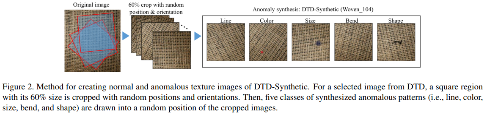

-----

| Title     | Datasets Image2D DTDSynthetic                         |
| --------- | ----------------------------------------------------- |
| Created @ | `2024-10-12T03:26:59Z`                                |
| Updated @ | `2024-10-12T03:27:40Z`                                |
| Labels    | \`\`                                                  |
| Edit @    | [here](https://github.com/junxnone/aiwiki/issues/482) |

-----

# DTD-Synthetic

  - [Zero-Shot Versus Many-Shot: Unsupervised Texture Anomaly
    Detection](https://openaccess.thecvf.com/content/WACV2023/papers/Aota_Zero-Shot_Versus_Many-Shot_Unsupervised_Texture_Anomaly_Detection_WACV_2023_paper.pdf)
    paper 中为了验证纹理方面的论点，借用了 DTD 中的图像来合成具有异常的纹理图像

## 生成方法

  - 从 DTD 中选择了 12 类适合目的的图像，这些图像的分辨率范围从 300×300 到 640×640 像素。
  - 对于从 DTD 中选择的一张图像，以随机的位置和方向裁剪出一个大小为其原始尺寸 60%
    的正方形区域。然后，将五类合成的异常图案（即线条、颜色、大小、弯曲和形状）绘制到裁剪后的图像的随机位置上。
  - 将所选的十二种纹理分为以下三个类别。每个类别包含四种不同的纹理。
      - 类别 1：具有完全规则的重复结构的各向异性纹理。它们与 MVTec AD
        中的网格相似，经常在由硬质材料制成的人造物体表面上找到。
      - 类别 2：具有一定不规则性的重复结构的各向异性纹理。它们与 MVTec AD
        中的地毯和木材相似，通常在纺织品和自然物体表面上找到。
      - 类别 3：没有明显重复图案的各向同性纹理。它们与 MVTec AD
        中的瓷砖和皮革相似；它们没有清晰的重复结构。在任何位置和方向上，它们的局部结构都是相同的。

## Reference

  - [Zero-Shot Versus Many-Shot: Unsupervised Texture Anomaly
    Detection](https://openaccess.thecvf.com/content/WACV2023/papers/Aota_Zero-Shot_Versus_Many-Shot_Unsupervised_Texture_Anomaly_Detection_WACV_2023_paper.pdf)
  - [Download the
    Dataset](https://drive.google.com/drive/folders/10OyPzvI3H6llCZBxKxFlKWt1Pw1tkMK1)
