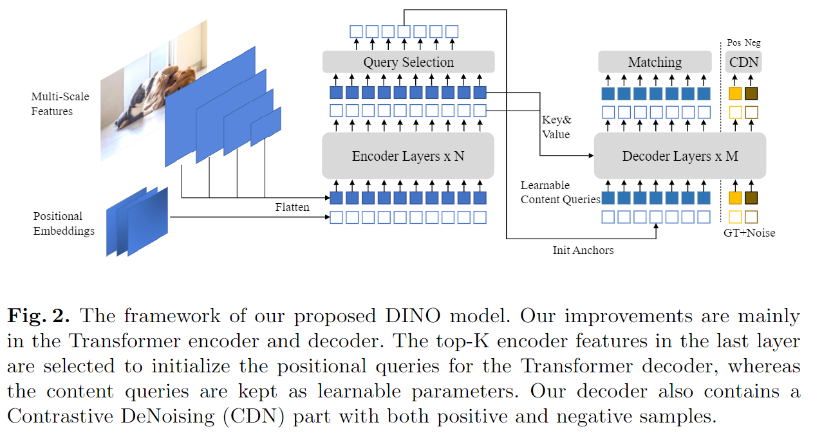
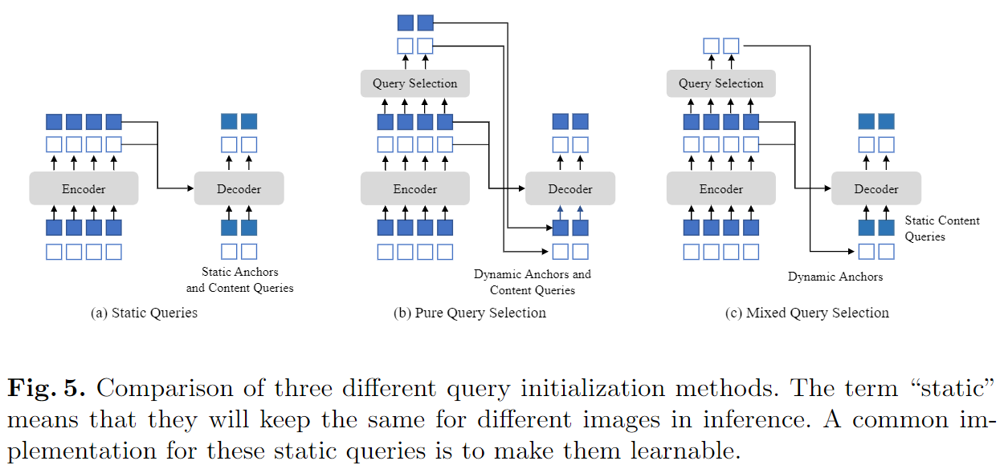
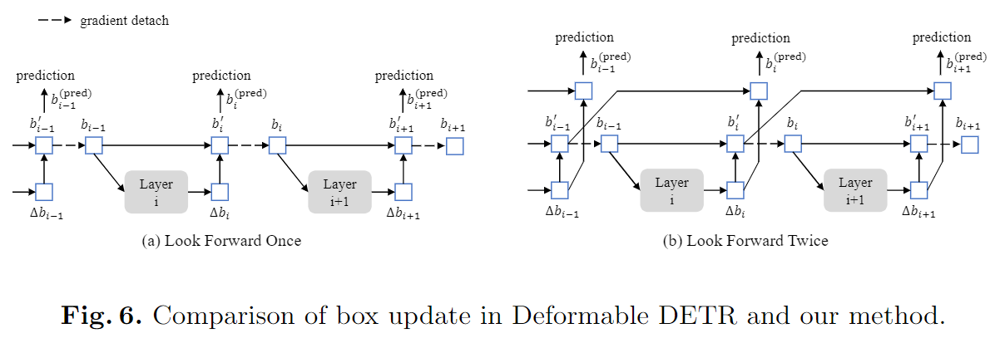

-----

| Title     | paper DINO                                            |
| --------- | ----------------------------------------------------- |
| Created @ | `2024-10-14T09:32:21Z`                                |
| Updated @ | `2024-10-14T09:32:22Z`                                |
| Labels    | \`\`                                                  |
| Edit @    | [here](https://github.com/junxnone/aiwiki/issues/483) |

-----

# DINO

  - **DINO** - **D**ETR with **I**mproved de**N**oising anch**O**r boxe
  - DETR 存在的问题
      - 收敛速度慢
      - 查询含义不明确
  - 参考优化
      - DAB-DETR - 将位置查询明确表示为 `Dynamic Anchor boxes`
      - DN-DETR - 引入噪声技术，在训练期间稳定二分匹配
      - Deformable - 加速收敛
  - End-to-End
  - 对比去噪训练
  - 混合查询方法初始化锚点

## Arch

  - 对比去噪训练（Contrastive DeNoising Training）
  - 混合查询选择（Mixed Query Selection）
  - 二次预测（Look Forward Twice）

### Mixed Query Selection

  - 与现有查询初始化方法对比，提出仅使用与所选 top - K
    特征相关的位置信息初始化锚框，内容查询保持可学习，避免所选特征对解码器的误导。

### Look Forward Twice

  - 根据 `Deformable DETR` 的一次预测方法，提出二次预测
  - 即层 i 的参数受层 i 和层 (i + 1) 的损失影响，通过使用下一层的输出监督当前层的最终框，提高预测框的精度

## Reference

  - [End-to-End Object Detection with
    Transformers](https://arxiv.org/abs/2005.12872)
  - [DINO: DETR with Improved DeNoising Anchor Boxes for End-to-End
    Object Detection](https://arxiv.org/abs/2203.03605)
  - [DAB-DETR: Dynamic Anchor Boxes are Better Queries for
    DETR](https://arxiv.org/abs/2201.12329)
  - [DN-DETR: Accelerate DETR Training by Introducing Query
    DeNoising](https://arxiv.org/abs/2203.01305)
  - [Deformable DETR: Deformable Transformers for End-to-End Object
    Detection](https://arxiv.org/abs/2010.04159)
