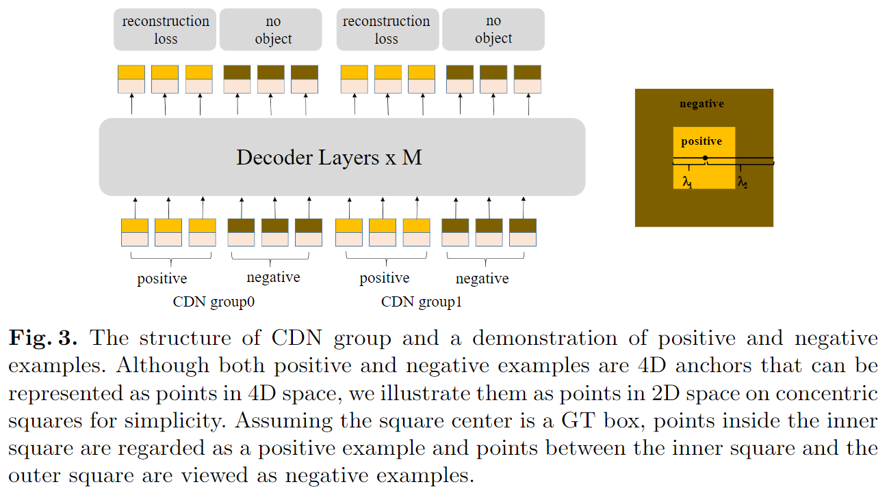

-----

| Title     | paper DINO                                            |
| --------- | ----------------------------------------------------- |
| Created @ | `2024-10-14T09:32:21Z`                                |
| Updated @ | `2024-10-15T09:53:33Z`                                |
| Labels    | \`\`                                                  |
| Edit @    | [here](https://github.com/junxnone/aiwiki/issues/483) |

-----

# DINO

  - **DINO** - **D**ETR with **I**mproved de**N**oising anch**O**r boxe
  - DETR 存在的问题
      - 收敛速度慢(`by decoder cross-attention` & `  instability of bipartite
        matching `)
      - 查询含义不明确
  - 参考优化
      - **DAB-DETR** - 将位置查询明确表示为 `Dynamic Anchor boxes`
      - **DN-DETR** - 引入噪声技术，在训练期间稳定二分匹配
      - **Deformable DETR** - 加速收敛
  - End-to-End
  - 对比去噪训练(contrastive denoising training) - 有助于模型避免同一目标的重复输出
  - 混合查询方法初始化锚点(mixed query selection) - 更好地初始化查询

## Arch

  - 对比去噪训练（Contrastive DeNoising Training）
  - 混合查询选择（Mixed Query Selection）
  - 二次预测（Look Forward Twice）

### Contrastive DeNoising Training

  - 生成两种类型的对比去噪（CDN）查询：正样本查询和负样本查询
  - 内正方形中的点表示正样本查询
  - 内正方形和外正方形之间的负样本查询
  - 通过噪声尺度( $\\lambda\_{1} \< \\lambda\_{2}$ )控制
  - 能够更好的抑制重复的框
  - 提升检测小目标能力

### Mixed Query Selection

  - DETR & DN-DETR 使用静态嵌入作为解码器查询 图5(a)
      - 学习位置查询，内容查询设置为 0 的向量
  - Deformable DETR
      - 学习 位置查询与内容查询
      - two-stage: 选择 Top K Encoder Feature 增强查询 图 5(b)
  - DINO 使用与所选 top - K 特征相关的位置信息初始化锚框，内容查询保持可学习，避免所选特征对解码器的误导。

### Look Forward Twice

  - 根据 `Deformable DETR` 的一次预测方法，提出二次预测
  - 即层 i 的参数受层 i 和层 (i + 1) 的损失影响，通过使用下一层的输出监督当前层的最终框，提高预测框的精度
  - 即优化初始化框 $b\_{i - 1}$ ，也优化框偏移量 $\\Delta b\_{i}$

预测框$b\_{i}^{(pred)}$的最终精度由两个因素决定：初始框$b\_{i - 1}$的质量和框的预测偏移量$\\Delta
b\_{i}$。“一次预测”方案仅优化后者，因为梯度信息只流向第(i - 1)层。相比之下，我们同时改进了初始框$b\_{i -
1}$和预测框偏移量$\\Delta b\_{i}$。一种提高质量的简单方法是用下一层的输出$\\Delta b\_{i +
1}$来监督第 i 层的最终框$b\_{i}'$。因此，我们使用$b\_{i}'$和$\\Delta b\_{i + 1}$的总和作为第(i +
1)层的预测框。

## Reference

  - [End-to-End Object Detection with
    Transformers](https://arxiv.org/abs/2005.12872)
  - [DINO: DETR with Improved DeNoising Anchor Boxes for End-to-End
    Object Detection](https://arxiv.org/abs/2203.03605)
  - [DAB-DETR: Dynamic Anchor Boxes are Better Queries for
    DETR](https://arxiv.org/abs/2201.12329)
  - [DN-DETR: Accelerate DETR Training by Introducing Query
    DeNoising](https://arxiv.org/abs/2203.01305)
  - [Deformable DETR: Deformable Transformers for End-to-End Object
    Detection](https://arxiv.org/abs/2010.04159)
