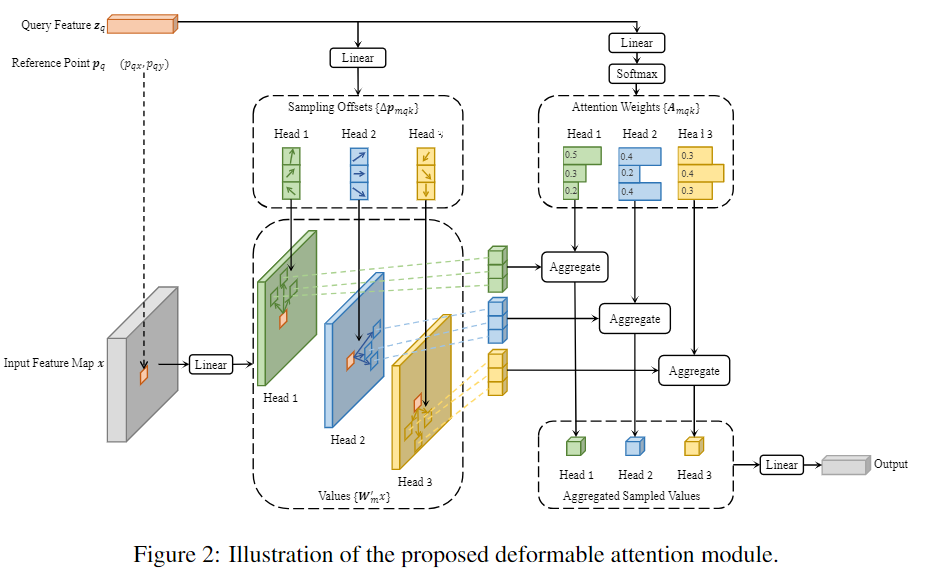

-----

| Title     | paper DeformableDETR                                  |
| --------- | ----------------------------------------------------- |
| Created @ | `2024-10-15T04:01:29Z`                                |
| Updated @ | `2024-10-15T05:25:15Z`                                |
| Labels    | \`\`                                                  |
| Edit @    | [here](https://github.com/junxnone/aiwiki/issues/484) |

-----

# Deformable DETR

## 改进方法

### 可变形注意力模块（Deformable Attention Module)

  - **设计思路**
      - 受到可变形卷积的启发，该模块只关注参考点周围的一小部分关键采样点，而不考虑特征图的空间大小。
  - **计算方式**
      - 给定输入特征图 $x\\in\\mathbb{R}^{C\\times H\\times W}$ ，设 $q$
        索引一个具有内容特征 $z\_{q}$ 和二维参考点 $p\_{q}$
        的查询元素，可变形注意力特征计算为
        $DeformAttn\\left(z\_{q},p\_{q},x\\right)=\\sum\_{m =
        1}^{M}W\_{m}\\left\[\\sum\_{k = 1}^{K}A\_{m q k}\\cdot
        W\_{m}'x\\left(p\_{q}+\\Delta p\_{m q k}\\right)\\right\]$ ，其中
        $m$ 索引注意力头， $k$ 索引采样键， $K$ 是总采样键数（ $K\\ll HW$ ）， $\\Delta p\_{m
        q k}$ 和 $A\_{m q k}$ 分别表示第 $m$ 个注意力头中第 $k$ 个采样点的采样偏移和注意力权重。
  - **复杂度分析**
      - 当 $MK$ 相对较小时，复杂度为 $O(2N\_{q}C^{2}+min(HWC^{2},N\_{q}KC^{2}))$
        。在DETR编码器中应用时（ $N\_{q}=HW$ ），复杂度变为 $O(HWC^{2})$
        ，在DETR解码器中作为交叉注意力模块应用时（ $N\_{q}=N$ ， $N$
        是对象查询数量），复杂度变为 $O(NKC^{2})$ 。
  - 优化:
      - 收敛速度提升
      - 特征空间分辨率改善
      - 复杂度降低

### 多尺度可变形注意力模块(Multi - scale Deformable Attention Module)

  - **设计思路**
      - 自然地扩展了可变形注意力模块以处理多尺度特征图。
  - **计算方式**
      - 设 ${x^{l}}\_{l = 1}^{L}$ 是输入多尺度特征图
      - $\\hat{p}\_{q}\\in\[0,1\]^{2}$ 是每个查询元素 $q$ 的参考点的归一化坐标
      - 则多尺度可变形注意力模块应用为:
      - $MSDeformAttn\\left(z\_{q},\\hat{p}*{q},{x^{l}}*{l =
        1}^{L}\\right)=\\sum\_{m = 1}^{M}W\_{m}\\left\[\\sum\_{l =
        1}^{L}\\sum\_{k = 1}^{K}A\_{m l q k}\\cdot
        W\_{m}'x^{l}\\left(\\phi\_{l}\\left(\\hat{p}*{q}\\right)+\\Delta
        p*{m l q k}\\right)\\right\]$
  - **与其他模块关系**
      - 当 $L = 1$ ， $K = 1$ ，且 $W\_{m}'\\in\\mathbb{R}^{C\_{v}\\times
        C'}$ 固定为单位矩阵时，该模块退化为可变形卷积。它也可被视为Transformer注意力的一种有效变体。
  - 优化:
      - 检测精度提高
      - 对特征金字塔网络（FPN）的替代作用

### 可变形Transformer编码器（Deformable Transformer Encoder）

  - **模块替换**
  - 用提出的多尺度可变形注意力模块替换DETR中处理特征图的Transformer注意力模块。
  - **特征图处理**
  - 从ResNet的 $C\_{3}$ 到 $C\_{5}$ 阶段的输出特征图中提取多尺度特征图 ${x^{l}}*{l = 1}^{L -
    1}(L = 4)$ ，最低分辨率特征图 $x^{L}$ 通过在最终 $C*{5}$ 阶段进行 $3\\times3$
    步长为2的卷积获得。所有多尺度特征图都有 $C = 256$ 个通道。
  - **参考点设置**
  - 对于每个查询像素，参考点是其自身，并且添加了尺度级嵌入 $e\_{l}$ 到特征表示中。
  - 优化:
      - 高效信息交换
      - 提升整体性能

### 可变形Transformer解码器（Deformable Transformer Decoder）

  - **模块替换**
      - 只将解码器中的每个交叉注意力模块替换为多尺度可变形注意力模块，而自注意力模块保持不变。
  - **参考点预测**
      - 对于每个对象查询，参考点的二维归一化坐标 $\\hat{p}\_{q}$
        通过其对象查询嵌入经由可学习的线性投影和sigmoid函数预测。
  - **边界框预测**
      - 检测头预测边界框作为相对于参考点的相对偏移，以降低优化难度。
  - 优化:
      - 加速训练收敛
      - 保持整体架构优势

### 迭代边界框细化（Iterative Bounding Box Refinement）

  - **设计思路**
      - 受到光流估计中迭代细化的启发，建立了一个简单有效的迭代边界框细化机制。
  - **细化过程**
      - 这里每个解码器层根据前一层的预测来细化边界框。
  - 优化:
      - 检测精度提升

<!-- end list -->

6.  **两阶段Deformable DETR（Two - Stage Deformable DETR）**

<!-- end list -->

  - **设计思路**
      - 探索了Deformable DETR的一种变体，用于生成区域提议作为第一阶段。
  - **第一阶段**
      - 去除解码器，形成一个仅编码器的Deformable
        DETR用于区域提议生成，每个像素作为对象查询直接预测边界框，选择得分最高的边界框作为区域提议。
  - **第二阶段**
      - 将区域提议作为对象查询输入解码器进行进一步细化。
  - 优化:
      - 提高召回率和精度
      - 综合性能提升

## Reference

  - [Deformable DETR: Deformable Transformers for End-to-End Object
    Detection](https://arxiv.org/abs/2010.04159)
