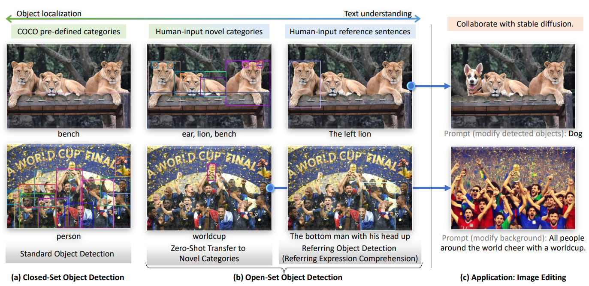
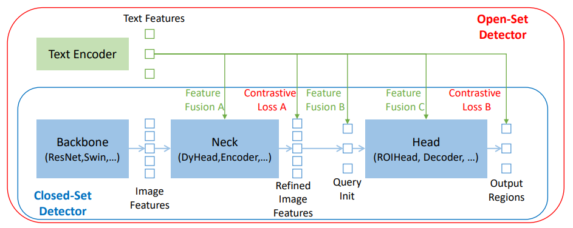

-----

| Title     | paper GroundingDINO cn                                |
| --------- | ----------------------------------------------------- |
| Created @ | `2024-10-15T10:27:35Z`                                |
| Updated @ | `2024-10-15T15:54:16Z`                                |
| Labels    | \`\`                                                  |
| Edit @    | [here](https://github.com/junxnone/aiwiki/issues/485) |

-----

# Grounding DINO 翻译

Shilong Liu1,2⋆, Zhaoyang Zeng2, Tianhe Ren2, Feng Li2, 3, Hao Zhang2,
3, Jie Yang2, 4, Qing Jiang2, 6Chunyuan $Li^{5}$ , Jianwei Yang5, Hang
$Su^{1}$ , Jun Zhu1⋆⋆, Lei Zhang2⋆⋆.

1 Dept. of Comp. Sci. and Tech., BNRist Center, State Key Lab for
Intell. Tech. & Sys., Institute for AI, Tsinghua-Bosch Joint Center for
ML, Tsinghua University 2 International Digital Economy Academy (IDEA) 3
The Hong Kong University of Science and Technology 4 The Chinese
University of Hong Kong (Shenzhen) 5 Microsoft Research, Redmond 6 South
China University of Technology

<liusl20@mails.tsinghua.edu.cn>, <leizhang@idea.edu.cn>



图 1： (a) 封闭集目标检测要求模型检测预定义类别的目标。 (b)
我们在新目标和标准的指代表达理解（REC）基准上评估模型，以测试模型对具有属性的新目标的泛化能力。
(c) 我们通过结合 Grounding DINO 和 Stable Diffusion \[41\]
展示了一个图像编辑应用程序。彩色观看效果最佳。

## 摘要

``` 
   在本文中，我们开发了一种开放集对象检测器，称为 Grounding DINO，它将基于 Transformer 的检测器 DINO 与基于文本的预训练相结合，可以通过人类输入（如类别名称或指示表达式）检测任意对象。开放集对象检测的关键解决方案是将语言引入封闭集检测器以实现开放集概念泛化。为了有效地融合语言和视觉模态，我们在概念上将封闭集检测器分为三个阶段，并提出了一种紧密融合的解决方案，其中包括特征增强器、语言引导的查询选择以及用于模态融合的跨模态解码器。我们首先在大规模数据集上对 Grounding DINO 进行预训练，包括目标检测数据、基础数据和字幕数据，并在开放集目标检测和指称目标检测基准上评估模型。Grounding DINO 在所有三种设置下表现都非常出色，包括在 COCO、LVIS、ODinW 和 $RefCOCO/+/g$ 上的基准。Grounding DINO 在 COCO 零样本 检测基准上达到 52.5 的平均精度。它在 ODinW 零样本基准上以平均 26.1 的平均精度创造了新纪录。我们在 https://github.com/IDEA-Research/GroundingDINO 上发布了一些检查点和推理代码。
```

关键词：目标检测·图像接地·多模态学习

## 介绍

``` 
   人工智能通用系统（AGI）能力的一个关键指标是其在处理开放世界场景中的熟练程度。在本文中，我们旨在开发一个强大的系统来检测由人类语言输入指定的任意对象，这个任务通常被称为开放集对象检测。由于其作为通用对象检测器的巨大潜力，该任务具有广泛的应用。例如，我们可以与生成模型合作进行图像编辑（如图 1（b）所示）。
   为了实现这一目标，我们遵循两个原则设计了强大的开放集目标检测器 Grounding DINO：基于 DINO 的紧密模态融合[57]以及用于概念泛化的大规模基础预训练。
   **基于 DINO 的紧密模态融合**。开放集检测的关键是引入语言以实现未见对象的泛化[1,7,25]。大多数现有的开放集检测器是通过将封闭集检测器扩展到具有语言信息的开放集场景中而开发的。如图 2 所示，封闭集检测器通常具有三个重要模块，用于特征提取的骨干网络、用于特征增强的 Neck 以及用于区域细化（或框预测）的 Head。封闭集检测器可以通过学习具有语言感知的区域嵌入来推广以检测新对象，使得每个区域可以在具有语言感知的语义空间中被分类为新类别。实现这一目标的关键是在颈部和/或头部输出处使用区域输出与语言特征之间的对比损失。
   为了帮助模型对齐跨模态信息，一些工作试图在最终损失阶段之前融合特征。我们总结了图 2 中的目标检测器的模块化设计。特征融合可以在三个阶段进行：颈部（阶段 A）、查询初始化（阶段 B）和头部（阶段 C）。例如，GLIP [25]在颈部模块（阶段 A）中进行早期融合，而 OV-DETR [55]将语言感知查询用作头部输入（阶段 B）。我们认为，在管道中引入更多的特征融合可以促进不同模态特征之间更好的对齐，从而实现更好的性能。
```



图 2：将封闭集检测器扩展到开放集场景。模块化设计。

大规模有监督预训练以实现零样本迁移。大多数现有的开放集模型\[14,21\]依赖于预训练的 CLIP 模型进行概念泛化。然而，正如
RegionCLIP\[61\]在其研究中所指出的，专门在图像-文本对上进行预训练的 CLIP
在区域-文本对检测任务中的功效有限。相比之下，GLIP\[25\]提供了一种不同的方法，它将目标检测重新定义为短语定位任务，并在大规模数据上引入对象区域和语言短语之间的对比训练。它在异构数据集上显示出极大的灵活性，并在封闭集和开放集检测中表现出卓越的性能。
