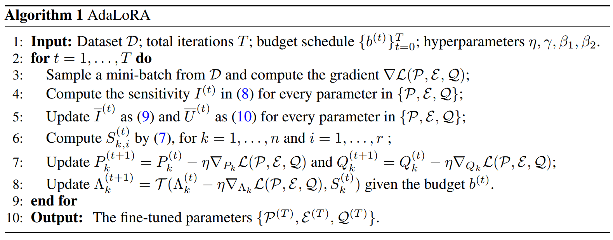

-----

| Title     | LM FT AdaLoRA                                         |
| --------- | ----------------------------------------------------- |
| Created @ | `2025-01-13T03:20:41Z`                                |
| Updated @ | `2025-02-12T08:49:39Z`                                |
| Labels    | \`\`                                                  |
| Edit @    | [here](https://github.com/junxnone/aiwiki/issues/491) |

-----

# AdaLoRA

  - 引入了自适应机制, 自适应调整秩，能依据训练动态变化优化模型。
  - 训练前期数据特征复杂，提高秩让模型学习更多信息；训练后期降低秩简化模型，防止过拟合，提升训练效率和模型性能。
  - 因需动态调整秩，增加额外计算开销和时间消耗。但在大规模数据和复杂任务中，虽训练时间增加，却能得到性能更好的模型
  - 通过动态调整秩，能在不同训练阶段优化模型结构，捕捉数据复杂特征，在复杂任务和数据分布变化场景中，模型性能和泛化能力更优。

## 原理

  - 将预训练权重矩阵的增量更新参数化为奇异值分解的形式: $W = W^{(0)} + \\Delta = W^{(0)} +
    P\\Lambda Q$
      - $(P \\in \\mathbb{R}^{d\_1×r})$ 和 $(Q \\in
        \\mathbb{R}^{r×d\_2})$ 分别表示 $(\\Delta)$ 的左/右奇异向量
      - 对角矩阵 $(\\Lambda \\in {R}^{r×r})$ 包含奇异值
        $\\{{\\lambda\_i}\\}\_{1≤i\<r}$
      - $r \\ll \\min(d\_1, d\_2)$
        提出新的重要性度量指标，结合奇异值和向量来计算每个三元组（包含第个奇异值和对应向量）的重要性得分。

## Reference

  - [AdaLoRA: Adaptive Budget Allocation for Parameter-Efficient
    Fine-Tuning](https://arxiv.org/pdf/2303.10512)
  - [AdaLoRA & LoRA 分析
    ](https://blog.csdn.net/qq_29788741/article/details/132957760)
