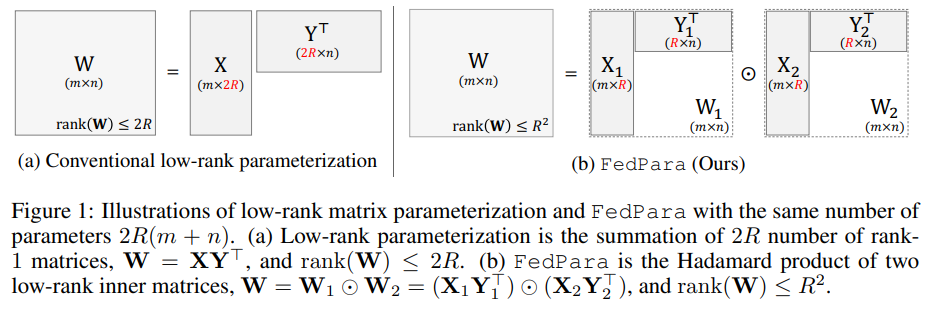

-----

| Title     | Hot LM Tuning LoHa                                    |
| --------- | ----------------------------------------------------- |
| Created @ | `2025-01-13T08:40:09Z`                                |
| Updated @ | `2025-01-13T08:40:09Z`                                |
| Labels    | \`\`                                                  |
| Edit @    | [here](https://github.com/junxnone/aiwiki/issues/492) |

-----

# LoHa

  - 利用哈达玛积（逐元素相乘）来构建低秩近似。这种表示方式在某些情况下可以更有效地捕捉数据中的复杂结构。
  - 在处理具有高度结构化数据（如图像、音频）的模型中，LoHa 能够利用哈达玛积的特性，更好地表示数据中的局部相关性和模式，相比 LoRA
    可能用更少的参数达到相同或更好的性能。
  - 通过其独特的参数化结构，在某些任务中可能会加速模型的收敛。
  - 对数据的局部结构和细节有更强的捕捉能力。在图像领域，对于图像的纹理、边缘等细节信息的学习和表示可能会更有效；在自然语言处理领域，对于具有特殊语义结构的文本部分，LoHa
    也可能通过更好地利用数据元素之间的相关性来提升模型的理解能力，从而在这些对细节和结构敏感的应用场景中有更好的表现。

## 原理

## Reference

  - [FedPara: Low-Rank Hadamard Product for Communication-Efficient
    Federated Learning](https://arxiv.org/pdf/2108.06098)
