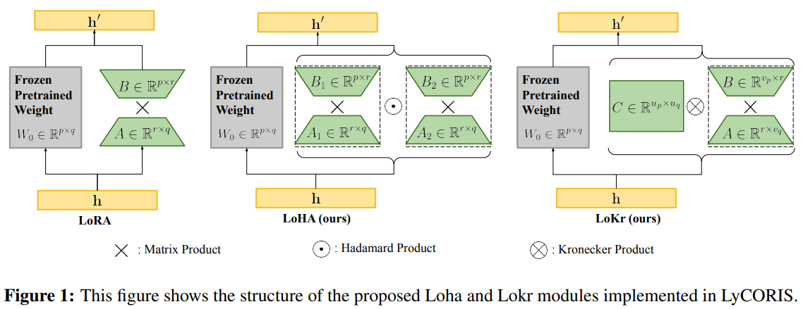

-----

| Title     | LM FT LoKr                                            |
| --------- | ----------------------------------------------------- |
| Created @ | `2025-01-13T09:00:32Z`                                |
| Updated @ | `2025-01-24T02:53:18Z`                                |
| Labels    | \`\`                                                  |
| Edit @    | [here](https://github.com/junxnone/aiwiki/issues/493) |

-----

# LoKr

  - 基于 Kronecker 积分解矩阵，可调整参数数量且灵活性高

## 原理

  - 对于Kronecker积，前向传播 $h' = W\_0h + b$ 被修改为：
  - $$h' = W\_0h + b + \\gamma\\Delta Wh = W\_0h + b + \\gamma\[C
    \\otimes(BA)\]h, \\quad$$
      - $C \\in \\mathbb{R}^{u\_{p}×u\_{q}}$
      - $B \\in \\mathbb{R}^{v\_{p}×r}$
      - $A \\in \\mathbb{R}^{r×v\_{q}}$ $$u\_{p}=\\max\\left(u \\leq
        \\min(f, \\sqrt{p}) \\mid p \\bmod u = 0\\right),\\quad
        v\_{p}=\\frac{p}{u\_{p}} 。$$

