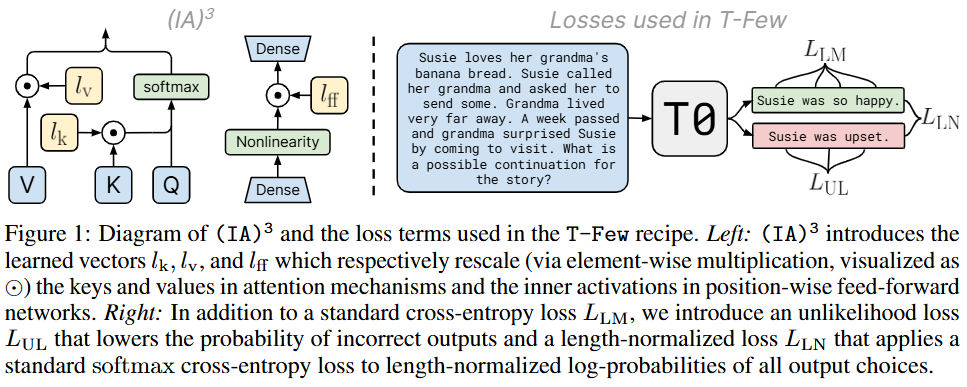
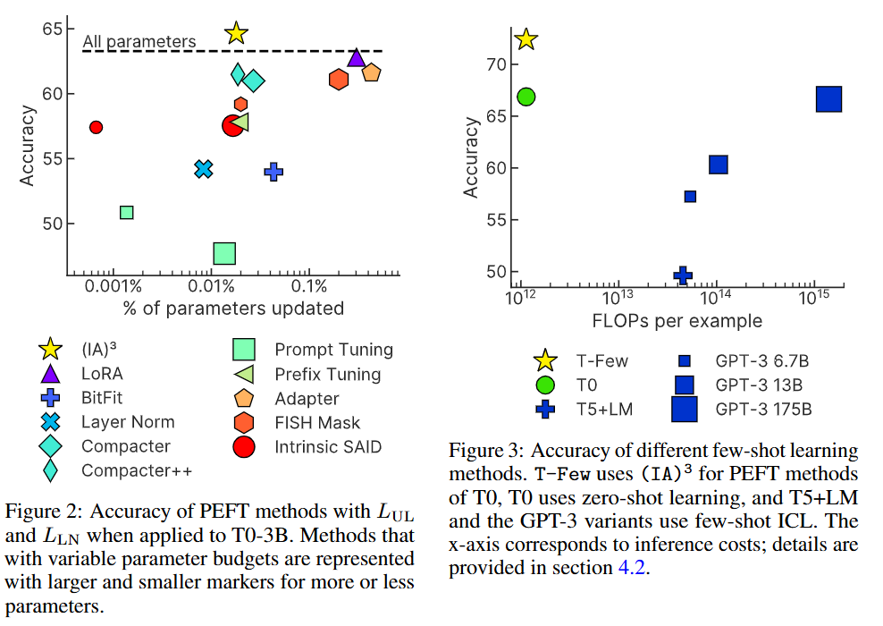

-----

| Title     | Hot LM Tuning IA3                                     |
| --------- | ----------------------------------------------------- |
| Created @ | `2025-01-16T03:06:12Z`                                |
| Updated @ | `2025-01-16T03:06:12Z`                                |
| Labels    | \`\`                                                  |
| Edit @    | [here](https://github.com/junxnone/aiwiki/issues/494) |

-----

# IA3

  - IA3 - `Infused Adapter by Inhibiting and Amplifying Inner
    Activations` - `通过抑制和放大内部激活注入适配器`
  - 通过学习向量对注意力机制中的键值和前馈网络的中间激活进行缩放。
  - 相比其他 PEFT 方法，(IA)³ 在少样本训练后准确性更高，且能实现混合任务批次处理，在特定情况下不会增加额外计算成本

## Arch

  - (IA)³引入了学习向量 $\\large l\_{k}$ 、 $\\large l\_{v}$ 和 $\\large l\_{ff}$
    ，它们分别通过元素级乘法（用⊙表示）对注意力机制中的键和值以及位置前馈网络中的内部激活进行重新缩放。
  - 除了标准的交叉熵损失 $\\large L\_{LM}$ 之外，还引入了不可能性损失 $\\large L\_{UL}$
    和长度归一化损失 $\\large L\_{LN}$ 。
      - 不可能性损失 $\\large L\_{UL}$
        用于降低不正确输出的概率，它通过计算模型对不正确目标序列的预测概率的对数并求和来实现。
      - 长度归一化损失 $\\large L\_{LN}$ 则是对所有输出选择的长度归一化对数概率应用标准的 softmax
        交叉熵损失，其目的是考虑到不同长度的答案选择在排名时的影响，使得模型在评估和训练过程中能够更合理地处理不同长度的输出，从而提高模型在少样本学习任务中的性能。

## 效果对比

## Reference

  - [Few-Shot Parameter-Efficient Fine-Tuning is Better and Cheaper than
    In-Context Learning](https://arxiv.org/abs/2205.05638)
