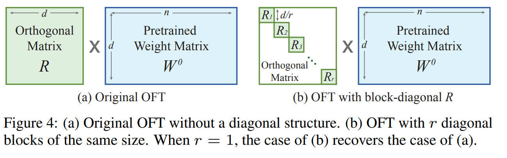
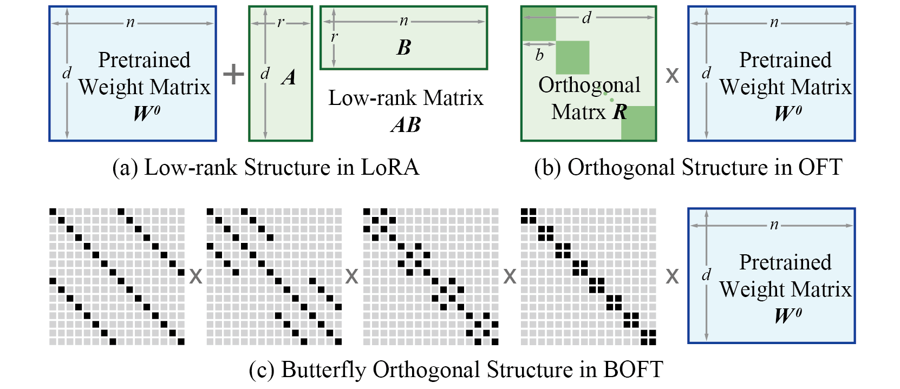
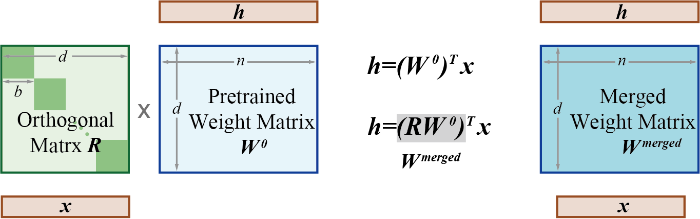

-----

| Title     | LM FT OFT                                             |
| --------- | ----------------------------------------------------- |
| Created @ | `2025-01-16T03:14:25Z`                                |
| Updated @ | `2025-01-24T02:53:32Z`                                |
| Labels    | \`\`                                                  |
| Edit @    | [here](https://github.com/junxnone/aiwiki/issues/495) |

-----

# OFT/BOFT

  - OFT
    利用正交矩阵对预训练权重矩阵进行乘法变换以实现高效微调，新矩阵在保持预训练权重矩阵不变的情况下适应新数据，最后将两者相乘得到结果。
  - BOFT 是 OFT 的推广，使用蝶形分解进一步提高参数效率和微调灵活性，OFT 可视为 BOFT 的特殊情况。
  - **Hyperspherical Energy**:
    超球能量被定义为同一层中所有成对神经元之间的超球相似度（例如余弦相似度）之和，它反映了神经元在单位超球面上的均匀程度

## Arch

### OFT & COFT

  - 对于一个预训练的全连接层 $W^{0}$ ，OFT试图找到一个正交矩阵 $R$ ，使得经过微调后的权重矩阵 $W = R\\cdot
    W^{0}$ 满足 $\\left| HE(W)-HE\\left(W^{0}\\right)\\right| = 0$ ，其中
    $HE(\\cdot)$ 表示权重矩阵的超球能量。
  - 在实现过程中，将正交矩阵 $R$ 初始化为单位矩阵，以确保微调从预训练权重开始。

### BOFT

## 权重合并

## Reference

  - [Controlling Text-to-Image Diffusion by Orthogonal
    Finetuning](https://arxiv.org/abs/2306.07280)
  - [Parameter-Efficient Orthogonal Finetuning via Butterfly
    Factorization](https://arxiv.org/abs/2311.06243)
